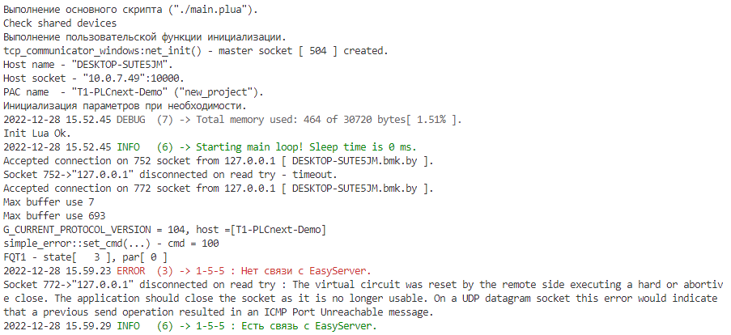
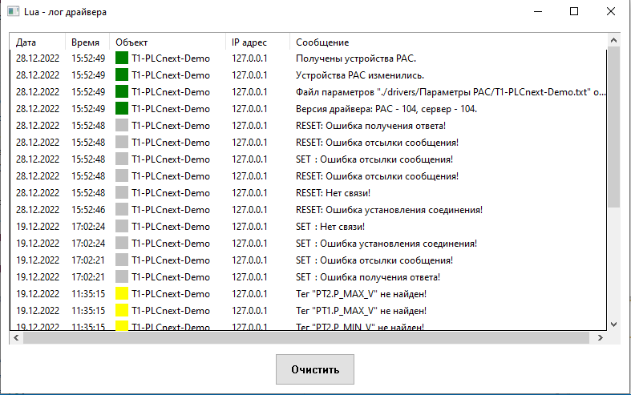

# Тестовый стенд **"T1_PLCNext_Demo"**

| Тегов | Строк кода | Аппаратов | Агрегатов | Устройств | IO-Link I/O | Узлов | Модулей |
|---|---|---|---|---|---|---|---|
| | | | | | | |

## Внешний вид демостенда


<p align="center"> Рисунок 1 - Демостенд</p>

## Содержание

Запуск в режиме эмуляции (эмулятор "на столе").

1. [Клонирование проекта](#клонирование-проекта)
2. [Установка Visual Studio Code](#установка-visual-studio-code)
3. [Установка Git LFS](#установка-git-lfs)
4. [Настройка DbEditorXML](#настройка-dbeditorxml)
5. [Установка и настройка EasyServer](#установка-и-настройка-easyserver)
6. [Установка и настройка Monitor](#установка-и-настройка-monitor)
7. [Запуск и сборка проекта](#запуск-и-сборка-проекта)
8. [Взаимодействие с физическим устройством Bus Coupler](#взаимодействие-с-физическим-устройством-bus-coupler)

Запуск на контроллере.

1. [Проверка текущей версии прошивки через веб-браузер](#проверка-текущей-версии-прошивки-через-веб-браузер)
2. [Установка файлов прошивки](#установка-файлов-прошивки)
3. [Обновление прошивки через веб-браузер](#обновление-прошивки-через-веб-браузер)
4. [Обновление прошивки контроллера через командную оболочку](#обновление-прошивки-контроллера-через-командную-оболочку)
5. [Создание проекта PLCnext Engineer](#создание-проекта-plcnext-engineer)
6. [Работа с проектом в среде PLCnext Engineer](#работа-с-проектом-в-среде-plcnext-engineer)
7. [Задание сетевых настроек контроллера](#задание-сетевых-настроек-контроллера)
8. [Подключение к контроллеру в программе PLCnext Engineer](#подключение-к-контроллеру-в-программе-plcnext-engineer)
9. [Обновление библиотеки](#обновление-библиотеки)
10. [Копирование Lua-файлов проекта](#копирование-lua-файлов-проекта)
11. [Включение суперпользователя](#включение-суперпользователя)
12. [Активация входа по SSH в качестве пользователя root](#активация-входа-по-ssh-в-качестве-пользователя-root)
13. [Деактивация входа по SSH в качестве пользователя root](#деактивация-входа-по-ssh-в-качестве-пользователя-root)
14. [Чтение логов](#чтение-логов)
15. [Запуск проекта](#запуск-проекта)
16. [Управление ходом выполнения проекта](#управление-ходом-выполнения-проекта)

Внешний вид демостенда.

## Запуск в режиме эмуляции (эмулятор "на столе")

Все необходимые компоненты (такие как: EasyServer, Monitor) находятся [здесь](https://github.com/savushkin-r-d/SCADA-ptusa-bin).

Пути к необходимым файлам будут зависеть от того, на каком локальном диске вашего компьютера вы их разместите.

В данной инструкции все файлы находятся на диске D:\ .

### Клонирование проекта

Проект T1_PLCNext_Demo находится [здесь](https://github.com/savushkin-r-d/T1-PLCnext-Demo).

Чтобы клонировать репозиторий, выполните следующую команду:

```cmd
git clone --recurse-submodules git@github.com:savushkin-r-d/T1-PLCnext-Demo.git
```

### Установка Visual Studio Code

Последняя версия Visual Studio Code находится [здесь](https://code.visualstudio.com/download).

Чтобы установить Visual Studio Code, выполните следующие действия:

- Скачайте файл прошивки формата *.exe последней версии с сайта.

- Запустите файл установки *.exe.

- Следуйте инструкциям мастера установки.

### Установка Git LFS

Последняя версия Git LFS находится [здесь](https://git-lfs.github.com/).

Чтобы установить Git LFS, выполните следующие действия:

- Скачайте файл прошивки формата *.exe последней версии с сайта.

- Запустите файл установки *.exe.

- Следуйте инструкциям мастера установки.

### Настройка DbEditorXML

- После установки EasyServer необходимо настроить IP адрес в DbEditorXML.

- В папке D:\Monitor запускаем файл DbEditorXML.exe.

- В меню нажимаем открыть драйвер.

<p align="center">
 </p>
<p align="center"> Рисунок 2 - Добавление драйвера </p>

- Выбираем файл в папке D:\Monitor\chbase\T1_PLCNext_Demo.cdbx и нажимаем "Открыть".

- Далее во вкладке "Устройства" выбираем "T1_PLCNext_Demo" и проверяем IP адрес. Должен быть установлен 127.0.0.1

<p align="center">
 </p>
<p align="center"> Рисунок 3 - Изменение IP адреса </p>

- Далее нажимаем "Ок".

- После этого в папке D:\Monitor запускаем приложение Bugger.exe, нажимаем "Показать" и проверяем, успешно ли загружен сервер.

### Установка и настройка EasyServer

Easy Server находится в папке D:\Monitor\EasyServer.exe.

- Необходимо запустить файл EasyServer.exe.

- В появившемся окне нажимаем "Настройки сервера".

<p align="center">
 </p>
<p align="center"> Рисунок 4 - Настройка сервера </p>

- Прописываем путь D:\Monitor\chbase

<p align="center">
 </p>
<p align="center"> Рисунок 5 - Настройка пути к базе каналов </p>

- Переходим во вкладку "Настройки проектов" и добавляем файл "T1_PLCNext_Demo.mpr", находящийся в папке D:\Monitor\projects\T1_PLCNext_Demo.mpr.

<p align="center">
 </p>
<p align="center"> Рисунок 6 - Настройка проекта </p>

- Далее переходим во вкладку "Настройка базы каналов" и добавляем файл "T1_PLCNext_Demo.cdbx", находящийся в папке D:\Monitor\chbase\T1_PLCNext_Demo.cdbx.

<p align="center">
 </p>
<p align="center"> Рисунок 7 - Настройка проекта </p>

- После добавления необходимых файлов нажимаем кнопку "Ok".

- Далее переходим на вкладку "База каналов".

<p align="center">
 </p>
<p align="center"> Рисунок 8 - Настройка базы каналов </p>

- Загружаем файл базы каналов. Файл находится в папке D:\Monitor\chbase\T1_PLCNext_Demo.cdbx.

<p align="center">
 </p>
<p align="center"> Рисунок 9 - Настройка базы каналов </p>

- Далее открываем проект. Файл находится в папке D:\Monitor\projects\T1_PLCNext_Demo.mpr.

<p align="center">
 </p>
<p align="center"> Рисунок 10 - Открытие проекта в EasyServer </p>

### Установка и настройка Monitor

Monitor находится в папке D:\Monitor

- Необходимо запустить файл Monitor.exe.

- В окне "Меню проектов" нажимаем кнопку "Добавить" и выбираем файл T1_PLCNext_Demo.mpr .

- Далее выбираем проект "T1_PLCNext_Demo" и нажимаем кнопку "Открыть".

- В появившемся окне заполняем данные, которые указаны на рисунке 10 и нажимаем "Ок".

<p align="center">
 </p>
<p align="center"> Рисунок 11 - Подключение к серверу </p>

### Запуск и сборка проекта

Описание управляющей программы реализовано в виде Lua-скриптов.

#### Visual Studio Code

Для тестирования проекта в меню сверху выбираем "Файл" -> "Открыть рабочую область из файла" -> "Выбираем файл рабочей области: (_D:\PTUSA-projects\T1_PLCNext_Demo\project.code-workspace_)".

- Тестирование проекта в VS Code осуществляется несколькими способами:

1. "Терминал" -> "Запуск задачи" -> "Debug run project";

2. Комбинация клавиш CTRL+SHIFT+B.

- Остановка тестирования осуществляется несколькими способами:

1. "Терминал" -> "Завершить задачу";

2. Комбинация клавиш CTRL+С при активном фокусе окна консоли. В данном случае содержимое консоли не очищается.

Запустить EasyServer.

Запустить Monitor.

Запустить проект в Visual Studio Code.

<p align="center">
 </p>
<p align="center"> Рисунок 12 - Visual Studio Code </p>

Соединение с Easy Server.

<p align="center">
 </p>
<p align="center"> Рисунок 13 - Easy Server </p>

В Monitor будут видны все устройства проекта тестового стенда T1_PLCNext_Demo с возможностью управления.

<p align="center">
 </p>
<p align="center"> Рисунок 14 - Monitor </p>

#### Visual Studio 2022

Для сборки проекта необходимо:

- клонировать репозитории [ptusa_main](https://github.com/NogameNo-life/ptusa_main) и [T1-PLCnext-Demo](https://github.com/NogameNo-life/T1-PLCnext-Demo/tree/readme_addition)

```cmd
git clone --recurse-submodules git@github.com:savushkin-r-d/ptusa_main.git
git clone --recurse-submodules git@github.com:savushkin-r-d/T1-PLCnext-Demo.git
```

Если клонировали без подмодулей, то их можно отдельно проинициализировать:

  ```cmd
  git submodule --init --recursive
  ```

- запустить Visual Studio, выбрать *открыть локальную папку->D:\\ ...\ptusa_main*

- сверху в управлении конфигурации выбрать *Windows Debug(windows-VS2022-debug-build-windows-VS2022-debug)*

- выбрать элемент запуска *ptusa_main.exe(Debug\ptusa_main.exe)*

- далее необходимо перейти в *Отладка->Параметры отладки и запуска для ptusa_main>* и дополнить содержимое файла *launch.vs.json*, прописывая собственные пути к файлам

```Json
{
  "version": "0.2.1",
  "defaults": {},
  "configurations": [
    {
      "type": "default",
      "project": "CMakeLists.txt",
      "projectTarget": "ptusa_main.exe (Debug\\ptusa_main.exe)",
      "name": "ptusa_main.exe (Debug\\ptusa_main.exe)",
      "cwd": "d:/PTUSA-projects/T1-PLCnext-Demo/",
      "args": [
        "d:/T1-PLCnext-Demo/main.plua",
        "sys_path",
        "d:/T1-PLCnext-Demo/sys/",
        "path",
        "d:/T1-PLCnext-Demo/",
        "extra_paths",
        "d:/T1-PLCnext-Demo/dairy-sys/",
        "debug"
      ]
    }
  ]
}
```

После чего запустить:

1. программу в режиме отладки (F5)
2. EasyServer
3. Monitor

### Взаимодействие с физическим устройством Bus Coupler

- С помощью Ethernet кабеля подключаем Bus Coupler к компьютеру.

- Переходим по пути Панель управления/Сеть и интернет/Сетевые подключения, нажимаем ПКМ на иконку неопознанной сети и выбираем "Свойства".

<p align="center">
 </p>
<p align="center"> Рисунок 15 - Настройка Ethernet </p>

- Выбираем пункт "IP версии 4 (TCP/IPv4)" и нажимаем кнопку "Свойства".

- Заполняем поля "IP-адрес" и "Маска подсети" как указано на рисунке 15.

<p align="center">
 </p>
<p align="center"> Рисунок 16 - Указание IP-адреса и маски подсети </p>

- Проверяем корректность настройки локальной сети Bus Coupler. В командной строке прописываем команду "ping 192.168.1.1".

<p align="center">
 </p>
<p align="center"> Рисунок 16 - Успешная отработка команды "ping 192.168.1.1" </p>

- Проверяем наличие связи с Bus Coupler. В командной строке прописываем команду "ping 192.168.1.11".

<p align="center">
 </p>
<p align="center"> Рисунок 18 - Успешная отработка команды "ping 192.168.1.11" </p>

- В браузере прописываем IP-адрес: 192.168.1.11 и нажимаем "Enter", после чего произойдёт переход на стартовую страницу Bus Coupler.

<p align="center">
 </p>
<p align="center"> Рисунок 19 - Стартовая страница Bus Coupler </p>

## Запуск на контроллере

### Проверка текущей версии прошивки через веб-браузер

- В адресной строке ввести IP-адрес контроллера по умолчанию *192.168.1.10*

Далее сайт оповестит вас, что ваше соединение не является приватным.

<p align="center">

</p>
<p align="center"> Рисунок 20 - Страница оповещения </p>

- Необходимо нажать **Принять риск и продолжить**

Далее вы перейдете на стартовую страницу контроллера.

<p align="center">

</p>
<p align="center"> Рисунок 21 - Страница приветствия </p>

- Нажимаем **Easy configuration**

По умолчанию введите следующие данные для авторизации:

```bash
Имя пользователя: admin
Пароль: Напечатан на контроллере.
```

Произойдет переход на стартовую страницу контроллера.

<p align="center">

</p>
<p align="center"> Рисунок 22 - Стартовая страница </p>

В правом верхнем углу можно увидеть версию прошивки. Перед тем как начать работу с проектом нужно проверить актуальность версии прошивки. Если на контроллере установлена свежая прошивка, то следующие 3 пункта пропускаем.

### Установка файлов прошивки

Последняя версия прошивки находится [здесь](https://www.phoenixcontact.com/en-pc/products/controller-axc-f-2152-2404267#downloads-link-target), в разделе Firmware скачайте последние версии Hardware Version и Compatible Tools.

Чтобы обновить прошивку контроллера, выполните следующие действия:

- Скачайте файл прошивки формата *.zip последней версии **LTS** на сайте Phoenix Contact.

- Распакуйте *.zip файл прошивки.

- Запустите файл установки *.exe.

- Следуйте инструкциям мастера установки.

При установке, файл прошивки (*.raucb) и PDF-файлы с информацией об устройстве будут скопированы в выбранный каталог.

#### Обновление прошивки через веб-браузер

Для обновления прошивки контроллера необходимо в ветке **Administration** перейти в вкладку **Firmware update**.

<p align="center">

</p>
<p align="center"> Рисунок 23 - Страница обновления прошивки </p>

Затем нажимаем на кнопку **Browse...**, выбираем файл прошивки (*.raucb) и нажимаем *Ok*.

Прошивка будет обновлена. Во время обновления прошивки светодиод RUN начинает мигать, а затем гаснет.
После этого контроллер перезапускается. После полной инициализации контроллера светодиод RUN горит постоянно.

#### Обновление прошивки контроллера через командную оболочку

- Откройте клиентское программное обеспечение SFTP (например [WinSCP](https://winscp.net/eng/index.php)).

- Авторизуйтесь как администратор.
<p align="center">

</p>
<p align="center"> Рисунок 24 - Авторизация в WinSCP </p>

По умолчанию введите следующие данные для авторизации:

```bash
Имя пользователя: admin
Пароль: Напечатан на контроллере.
```

<p align="center">

</p>
<p align="center"> Рисунок 25 - Нахождение пароля </p>

- Скопируйте файл прошивки *.raucb в **/opt/plcnext** каталог (каталог по умолчанию пользователя Linux «admin»).

- Откройте командную оболочку с помощью инструмента командной строки (например, [PuTTY](https://www.putty.org/), в WinSCP сочетание клавиш Ctrl+P).

- Авторизуйтесь как администратор.

По умолчанию введите следующие данные для авторизации:
Имя пользователя: admin
Пароль: Напечатан на контроллере.

- Перейдите в **/opt/plcnext** каталог (команда: *cd /opt/plcnext*).

- Для обновления прошивки введите команду:

```sh
sudo update-axcf2152
```

Необходимо ввести пароль администратора.

Прошивка будет обновлена. Во время обновления прошивки светодиод RUN начинает мигать, а затем гаснет.
После этого контроллер перезапускается. После полной инициализации контроллера светодиод RUN горит постоянно.
Файл обновления автоматически удаляется из **/opt/plcnext** directory.

### Создание проекта PLCnext Engineer

Копируем каталог проекта *PLCnext*, который находится здесь - **https://github.com/savushkin-r-d/T1-PLCnext-Demo/releases/latest** - в каталог проекта в подкаталог **PLCnext Engineer**.

### Работа с проектом в среде PLCnext Engineer

Запускаем PLCnext Engineer, открываем файл проекта, который находится в данном каталоге - **PLCnext Engineer\T1-PLCNext-Demo.pcwex**.

Открываем свойства проекта (двойной щелчок мышью по элементу дерева **Project**) - здесь мы видим текущие сетевые настройки для устройств проекта (контроллеров и узлов ввода\вывода).


<p align="center"> Рисунок 26 - Задание настроек сети </p>

При необходимости, меняем сетевые настройки устройств проекта на данной странице.

На вкладке **IP Subnet** отображаются настройки контроллера проекта (также их можно редактировать):


<p align="center"> Рисунок 27 - Задание настроек подсети </p>

### Задание сетевых настроек контроллера

Подключаем контроллер к питанию и сети. Переходим к вкладке **Online Controllers** выбираем *Ethernet 2 Realtek USB GbE Family Controller* и нажимаем кнопку *Scan the network*:

<p align="center">
 </p>
<p align="center"> Рисунок 28 - Поиск контроллера </p>

После успешного поиска в данном окне отобразятся найденные устройства - должен появиться подключенный контроллер с настройками по умолчанию:


<p align="center"> Рисунок 29 - Найденные контроллеры </p>

Указываем для найденного контроллера его соответствие в проекте. Для этого нужно выбрать контроллер с необходимым MAC address, указанный на корпусе:


<p align="center"> Рисунок 30 - Добавление контроллера </p>

Данный контроллер добавится в проект, через некоторое время он отобразится с новыми настройками:


<p align="center"> Рисунок 31 - Контролеры в проекте </p>

### Подключение к контроллеру в программе PLCnext Engineer

Переходим на вкладку с настройками контроллера:


<p align="center"> Рисунок 32 - Обзор контроллера </p>

Далее нажимаем на кнопку подключения:


<p align="center"> Рисунок 33 - Подключение к контроллеру </p>

Далее вводим имя пользователя (**admin**) и пароль (**напечатан на корпусе контроллера**). После успешного подключения отображаются текущие параметры контроллера:


<p align="center"> Рисунок 34 - Подключенный контроллер </p>

### Обновление библиотеки

Последняя версия библиотеки находится [здесь](https://github.com/savushkin-r-d/ptusa_main/releases).

#### Обновление библиотеки через командную оболочку

Для обновления библиотеки через командную оболочку необходимо:

- Скачать файл последней версии библиотеки (*.PCWLX).

- Скопировать данный файл с заменой в папку **PLCnext** необходимого проекта.

- Откройте клиентское программное обеспечение SFTP (например **WinSCP**).

- Авторизуйтесь как администратор (**admin - обратитесь к администратору**).

- Копировать файл с заменой файла библиотеки из **/AXCF2152_22.0.4.144/Release/lib/libPtusaPLCnextEngineer.so** в каталог **/opt/plcnext/projects/PCWE/Libs/Ptusa**, где `AXCF2152_22.0.4.144` - соответствующая версия библиотеки.

- Откройте командную оболочку с помощью инструмента командной строки (например, **KiTTY**).

- Авторизуйтесь как администратор (**admin - обратитесь к администратору**).

- Перезапустите службу **plcnext** (команда: **sudo /etc/init.d/plcnext restart**).

#### Обновление-библиотеки через программное обеспечение PLCnext Engineer

Для обновление библиотеки с помощью программного обеспечения необходимо:

- Скачать файл последней версии библиотеки (*.PCWLX).

- Скопировать данный файл с заменой в папку **PLCnext** необходимого проекта.

- Запускаем PLCnext Engineer, открываем файл проекта, который находится в данном каталоге **PLCnext Engineer\T1-PLCNext-Demo.pcwex**.

- Переходим на вкладку с настройками контроллера (рисунок 30).

- Далее нажимаем на кнопку подключения (рисунок 32).

- Вводим имя пользователя **admin** и пароль **обратитесь к администратору** После успешного подключения отображаются текущие параметры контроллера.

- Нажимаем кнопку Записать и начать выполнение (F5) (рисунок 33).

### Копирование Lua-файлов проекта

Необходимо через **SFTP** интерфейс записать файлы конфигурации проекта на контроллер в каталог **/opt/main**.

Для этого предлагается использовать программу [WinSCP](https://winscp.net/eng/index.php).

Выбираем файлы проекта, которые необходимо записать на контроллер. Данные файлы находятся в текущем каталоге проекта. Список файлов, описывающих проект:

- __*main.plua*__ - описание управляющей программы;
- __*main.io.lua*__ - описание привязки устройств к модулям ввода/вывода;
- __*main.modbus_srv.lua*__ - описание взаимодействия с modbus-клиентами;
- __*main.objects.lua*__ - описание объектов проекта;
- __*main.profibus.lua*__ - описание profibus;
- __*main.restrictions.lua*__ - описание ограничений;
- __*prg.lua*__ - описание аппаратов, агрегатов.

Также необходимо скопировать системные файлы из каталога **sys**. Список системных файлов:

- __*sys.devices.lua*__ - описание устройств;
- __*sys.objects.lua*__ - описание объектов;
- __*sys.io.lua*__ - описание модулей ввода-вывода;

Копируем данные файлы на контроллер в отдельно созданный каталог **/opt/main/sys**.

### Включение суперпользователя

Для включения пользователя **root** подключаемся по ssh (используя **Kitty**) и используем следующую команду:

```sh
sudo passwd root
```

После ввода пароля текущего пользователя задаем пароль для **root** .

```sh
Password:
Changing password for root
Enter the new password (minimum of 5 characters)
Please use a combination of upper and lower case letters and numbers.
New password:
Re-enter new password:
passwd: password changed.
```

### Активация входа по SSH в качестве пользователя root

- Подключитесь к контроллеру и войдите в систему **admin**.

- Откройте файл */etc/ssh/sshd_config* в подходящем редакторе в **WinSCP**.

- В разделе #Authentication: раскомментируйте запись: `#PermitRootLogin yes`.

- Перезапустите службу SSH с помощью *sudo /etc/init.d/sshd restart*

### Деактивация входа по SSH в качестве пользователя root

- Подключитесь к контроллеру и войдите в систему **admin**.

- Откройте файл */etc/ssh/sshd_config* в подходящем редакторе (**WinSCP**).

- В разделе #Authentication: закомментируйте запись: `PermitRootLogin yes`.

- Перезапустите службу SSH с помощью *sudo /etc/init.d/sshd restart*

### Чтение логов

Для чтения сообщений от управляющей программы подключаемся по ssh (используя **Kitty**). Чтение логов доступно для пользователя **root**. Для переключения пользователя выполняем следующую команду:

```sh
su
```

Далее вводим пароль. После успешного переключения отображается соответствующее приглашение командной строки:

```sh
root@axcf2152:/opt/plcnext/#
```

Для чтения аварийных логов используем следующую команду:

```sh
tail -F /var/log/error | grep ptusa
```

Для чтения всех остальных логов используем следующую команду:

```sh
tail -F /var/log/messages | awk '
  /info/ {print "\033[32m" $0 "\033[39m"; next}
  /warn/ {print "\033[33m" $0 "\033[39m"; next}
  1 {print}
  ' | grep ptusa
```

### Запуск проекта через **PLCnext Engineer**

Нажимаем кнопку **Записать и начать выполнение**:


<p align="center"> Рисунок 35 - Запуск проекта</p>

При успешном запуске в окне просмотра логов не должно быть аварийных сообщений:


<p align="center"> Рисунок 36 - Просмотр сообщений </p>

### Управление ходом выполнения проекта

Для перезапуска необходимо выполнить следующую команду в консоли:

```sh
sudo /etc/init.d/plcnext restart
```

Для остановки и запуска проекта необходимо выполнить следующие команды в консоли:

```sh
sudo /etc/init.d/plcnext stop
sudo /etc/init.d/plcnext start
```

### Настройка устройств сопряжения с шиной *AXL F BK ETH*

#### Необходимо ознакомиться с приложением [Startup+](https://www.phoenixcontact.com/online/portal/us/?uri=pxc-oc-itemdetail:pid=2700636&library=usen&pcck=P&tab=1&selectedCategory=ALL).

Скачать с сайта Phoenix Contact утилиту [Startup+ от Phoenix Contact](https://www.phoenixcontact.com/online/portal/us/?uri=pxc-oc-itemdetail:pid=2700636&library=usen&pcck=P&tab=1&selectedCategory=ALL) для настройки. После запуска данной утилиты открывается главное окно и выбираем создать новый проект:


<p align="center"> Рисунок 37 - Запуск утилиты</p>

В следующем окне выбираем модель устройства сопряжения с шиной (Указана на корпусе устройства):


<p align="center"> Рисунок 37 - Выбор модели устройства сопряжения с шиной</p>

Жмём **Next** и выбираем тип подключения. В нашем случае Ethernet:


<p align="center"> Рисунок 39 - Настройка сетевых параметров</p>

Далее выбираем пункт *Найти устройство в сети и задать IP address*:


<p align="center"> Рисунок 40 - Настройка сетевых параметров</p>

Далее в списке обнаруженных устройств (посылающих запрос) необходимо выбрать требуемое (MAC адрес устройства должен соответствовать MAC адресу, который напечатан на корпусе настраиваемого узла BK ETH). Через двойной клик по необходимому устройству переходим к окну настройки:


<p align="center"> Рисунок 41 - Настройка сетевых параметров</p>

Задаем требуемые настройки и записываем их в устройство.
- В DbEditorXML меняем ip на *192.168.1.10*.
- Запускаем EasyServer и Monitor.

### Запуск проекта через консоль

Для запуска проекта через консоль необходимо:

1. Установить Toolchain нужной версии (подробная инструкция по установке [здесь](https://github.com/savushkin-r-d/ptusa_main#using-plcnext-technology-c-toolchain-in-windows)).

2. Подключиться к контроллеру через клиентское программное обеспечение [WinSCP](https://winscp.net/eng/index.php).

3. Перейти в каталог для своего контроллера `ptusa_main\bin\install\AXCF3152\Release\bin\` и оттуда скопировать исполняемый файл `ptusa_main` в свой каталог на контроллере, например `/opt/main/`.

4. Далее в этот же каталог скопировать файлы с расширением `lua` и `plua`, a также директории `spec` и `sys` из проекта `T1-PLCnext-Demo`.

5. После чего открыть Kitty, перейти в каталог со всеми скопированными файлами

```bash
cd /opt/main/
```

И запустить исполняемый файл `ptusa_main`

```bash
./ptusa_main main.plua sys_path ./sys/
```

В случае возникновения ошибки `Permission denied` добавить файлу флаг -x, чтобы сделать его исполняемым. Это можно реализовать либо через интерфейс ***WinSCP*** либо через консоль с помощью команды `chmod`.

```bash
chmod +x ptusa_main
```

## Наименование модулей и устройств

Разработанный демостенд:


<p align="center"> Рисунок 42 - Общий вид</p>


<p align="center"> Рисунок 43 - Контроллер и узел ввода\вывода</p>


<p align="center"> Рисунок 44 - Датчики и исполнительные устройства</p>
