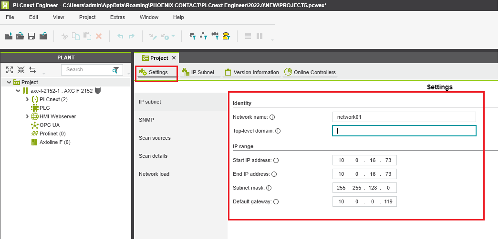

# Настройка контроллера на примере проекта тестового стенда **T1_PLCNext_Demo**.

| Тегов | Строк кода | Аппаратов | Агрегатов | Устройств | IO-Link I/O | Узлов | Модулей |
|---|---|---|---|---|---|---|---|
| | | | | | | |

# Содержание

# Запуск в режиме эмуляции (эмулятор "на столе")

1. [Клонирование проекта](#Клонирование-проекта)
2. [Установка Visual Studio Code](#Установка-Visual-Studio-Code)
3. [Установка Git LFS](#Установка-Git-LFS)
4. [Настройка DbEditorXML](#Настройка-DbEditorXML)
5. [Установка и настройка EasyServer](#Установка-и-настройка-EasyServer)
6. [Установка и настройка Monitor](#Установка-и-настройка-Monitor)
7. [Запуск и сборка проекта](#Запуск-и-сборка-проекта)

# Запуск на контроллере

1. [Установка файлов прошивки](#Установка-файлов-прошивки)
2. [Обновление прошивки контроллера через командную оболочку](#Обновление-прошивки-контроллера-через-командную-оболочку)
3. [Обновление прошивки через веб-браузер](#Обновление-прошивки-через-веб-браузер)
4. [Создание нового проекта на основе базового](#Создание-нового-проекта-на-основе-базового)
5. [Работа с проектом в среде PLCnext Engineer](#Работа-с-проектом-в-среде-PLCnext-Engineer)
6. [Задание сетевых настроек контроллера](#Задание-сетевых-настроек-контроллера)
7. [Подключение к контроллеру в программе PLCnext Engineer](#Подключение-к-контроллеру-в-программе-PLCnext-Engineer)
8. [Задание пароля](#Задание-пароля)
9. [Обновление библиотеки](#Обновление-библиотеки)
10. [Копирование Lua-файлов проекта](#Копирование-Lua-файлов-проекта)
11. [Включение суперпользователя](#Включение-суперпользователя)
12. [Активация входа по SSH в качестве пользователя root](#Активация-входа-по-SSH-в-качестве-пользователя-root)
13. [Деактивация входа по SSH в качестве пользователя root](#Деактивация-входа-по-SSH-в-качестве-пользователя-root)
14. [Чтение логов](#Чтение-логов)
15. [Запуск проекта](#Запуск-проекта)
16. [Управление ходом выполнения проекта](#Управление-ходом-выполнения-проекта)

# Запуск в режиме эмуляции (эмулятор "на столе")

Для всех компонентов следует создать на компьютере новый диск (P) и разместить их в нём. Все необходимые компоненты (такие как: EasyServer, Monitor) нужно скачать с USB устройства.

## Клонирование проекта

Проект T1_PLCNext_Demo находится [здесь](https://github.com/savushkin-r-d/T1-PLCnext-Demo).

## Установка Visual Studio Code

Последняя версия Visual Studio Code находится [здесь](https://code.visualstudio.com/download).

Чтобы установить Visual Studio Code, выполните следующие действия:

- Скачайте файл прошивки формата *.exe последней версии с сайта.

- Запустите файл установки *.exe.

- Следуйте инструкциям мастера установки.

### Установка Git LFS

Последняя версия Git LFS находится [здесь](https://git-lfs.github.com/).

Чтобы установить Git LFS, выполните следующие действия:

- Скачайте файл прошивки формата *.exe последней версии с сайта.

- Запустите файл установки *.exe.

- Следуйте инструкциям мастера установки.

## Настройка DbEditorXML

- После установки EasyServer необходимо настроить IP адрес в DbEditorXML.

- В папке P:\Monitor запускаем файл DbEditorXML.exe.

- В меню нажимаем открыть драйвер.

<p align="center">
 </p>
<p align="center"> Рисунок 1 - Добавление драйвера </p>

- Выбираем файл в папке P:\Monitor\chbase\T1_PLCNext_Demo.cdbx и нажимаем "Открыть".

- Далее во вкладке "Устройства" выбираем "T1_PLCNext_Demo" и изменяем IP адрес на 127.0.0.1. Это необходимо для локального подключения.

<p align="center">
 </p>
<p align="center"> Рисунок 2 - Изменение IP адреса </p>

- Далее нажимаем "Ок" и "Применить".

- После этого в папке P:\Monitor запускаем приложение Bugger.exe, нажимаем "Показать" и проверяем, успешно ли загружен сервер.

## Установка и настройка EasyServer

Easy Server находится в папке P:\Monitor\EasyServer.exe.

- Необходимо запустить файл EasyServer.exe.

- В появившемся окне нажимаем "Настройки сервера".

<p align="center">
 </p>
<p align="center"> Рисунок 3 - Настройка сервера </p>

- Прописываем путь P:\Monitor\ChBase

<p align="center">
 </p>
<p align="center"> Рисунок 4 - Настройка пути к базе каналов </p>

- Переходим во вкладку "Настройки проектов" и добавляем файл "T1_PLCNext_Demo.mpr", находящийся в папке P:\Monitor\projects\T1_PLCNext_Demo.mpr.

<p align="center">
 </p>
<p align="center"> Рисунок 5 - Настройка проекта </p>

- Далее переходим во вкладку "Настройка базы каналов" и добавляем файл "T1_PLCNext_Demo.cdbx", находящийся в папке P:\Monitor\chbase\T1_PLCNext_Demo.cdbx.

<p align="center">
 </p>
<p align="center"> Рисунок 6 - Настройка проекта </p>

- После добавления необходимых файлов нажимаем кнопку "Ok".

- Далее переходим на вкладку "База каналов".

<p align="center">
 </p>
<p align="center"> Рисунок 7 - Настройка базы каналов </p>

- Загружаем файл базы каналов. Файл находится в папке P:\Monitor\chbase\T1_PLCNext_Demo.cdbx.

<p align="center">
 </p>
<p align="center"> Рисунок 8 - Настройка базы каналов </p>

- Далее открываем проект. Файл находится в папке P:\Monitor\projects\T1_PLCNext_Demo.mpr.

<p align="center">
 </p>
<p align="center"> Рисунок 9 - Открытие проекта в EasyServer </p>

## Установка и настройка Monitor

Monitor находится в папке P:\Monitor

- Необходимо запустить файл Monitor.exe.

- В появившемся окне заполнить данные, которые указаны на рисунке 34 и нажать "Ок".

<p align="center">
 </p>
<p align="center"> Рисунок 10 - Подключение к серверу </p>

## Запуск и сборка проекта

Описание управляющей программы реализовано в виде Lua-скриптов.

Для тестирования проекта в меню сверху выбираем "Файл" -> "Открыть рабочую область из файла" -> "Выбираем файл рабочей области: (_P:\PTUSA-projects\T1_PLCNext_Demo\project.code-workspace_)".

- Тестирование проекта в VS Code осуществляется несколькими способами:

1. "Терминал" -> "Запуск задачи" -> "Debug run project";

2. Комбинация клавиш CTRL+SHIFT+B.

- Остановка тестирования осуществляется несколькими способами:

1. "Терминал" -> "Завершить задачу";

2. Комбинация клавиш CTRL+С при активном фокусе окна консоли. В данном случае содержимое консоли не очищается.

Запустить EasyServer.

Запустить Monitor.

Сборка проекта в Visual Studio Code.

<p align="center">
 </p>
<p align="center"> Рисунок 11 - Visual Studio Code </p>

Соединение с Easy Server.

<p align="center">
 </p>
<p align="center"> Рисунок 12 - Easy Server </p>

В Monitor будут видны все устройства проекта тестового стенда T1_PLCNext_Demo с возможностью управления.

<p align="center">
 </p>
<p align="center"> Рисунок 13 - Monitor </p>

# Запуск на контроллере

## Установка файлов прошивки

Последняя версия прошивки находится [здесь](https://www.phoenixcontact.com/online/portal/pi/pxc/product_detail_page/!ut/p/z1/3VfNctowEH4VLhyN5H_7SAgNkJDCAI3ti0e2ZarUf9gCh5wyfYy-R0-d9hngjSobOglMY6bD0INtzdgS-3273y4LErCAAawIrcgcURJHKGBz01Js4YaHfE_ihx_VsQrHV3fd8U33VhgPZfAJWMBK0thburTvAVOQoCQoarFKkQNMvngLiJOidA3MhKTLYiHFiyXO6HSdYLa4Q5dE5JAi9kedzi0wR5zAc7zEwZKOEhow3Obb5tfm5_br9oU9f7D7-_alwTXaRqfxoSHwssAmf7geqnS075mzapk7PHznasNTeJPh1XcNZiKYFMJIlFEUubjIwl_z9prSFDOzFU53hvsUXmOKSJD1KQ6PanGc2MTzw9jDe3SckaLeB1xsPsVPdL_mul-Oq8AoAhTNl2he0FQL5GHdBQp1F8jXXWDde7BX9x7s1b0He3XvwV7de1Cvew_qdf-K6nX_kdFVJtC8AqahNaE_HYMBE-uErdwNW7CVPLmtvVfbKyXYScHKzgnkcbGw2sBy44gW0RhFJpowx04ThohETbgHZk0YkIyWQPY-uutEzN6m2P0cxUE8X9tuHCZxhCOa2a9CWDSq6kPsQE5AKuQk6Iqcpqg6p3q-IMkQC4rnsJ26VbUZL_f6pUHFZn6SLu3rrj0yOqP-iXS1JfCwIjgHsyhOQ3ZimuyKUBbRE3UPKR6nyx6LF-syi9cRONmXRF9DKi8rOmB_yyc8KGd6OEEvX5R-fFl65bLJKU6OF6Qfnhv9oPLcOeHP6cskcCv6MvnXvkzCUBP3g5sZz1PsPL8d_pvPd8O-v5dXB4NDhxjsaFA8gsnJ6gj2X11paxE-SuZgledTP-w42uFjnf8Glh9cWw!!/?uri=pxc-iframe-integration:firmwaredownload&prodid=2404267).

Чтобы обновить прошивку контроллера, выполните следующие действия:

- Скачайте файл прошивки формата *.zip последней версии **LTS** на сайте Phoenix Contact.

- Распакуйте *.zip файл прошивки.

- Запустите файл установки *.exe.

- Следуйте инструкциям мастера установки.

При установке, файл прошивки (*.raucb) и PDF-файлы с информацией об устройстве будут скопированы в выбранный каталог.

### Обновление прошивки контроллера через командную оболочку

- Откройте клиентское программное обеспечение SFTP (например **WinSCP**).

- Авторизуйтесь как администратор.

По умолчанию введите следующие данные для авторизации:
```
Имя пользователя: admin
Пароль: Напечатан на контроллере.
```

<p align="center">

</p>
<p align="center"> Рисунок 11 - Нахождение пароля </p>

- Скопируйте файл прошивки *.raucb в **/opt/plcnext** каталог (каталог по умолчанию пользователя Linux «admin»).

- Откройте командную оболочку с помощью инструмента командной строки (например, **PuTTY**).

- Авторизуйтесь как администратор.

По умолчанию введите следующие данные для авторизации:
Имя пользователя: admin
Пароль: Напечатан на контроллере.

- Перейдите в **/opt/plcnext** каталог (команда: *cd /opt/plcnext*).

- Для обновления прошивки введите команду:
```sh
sudo update-axcf2152
```

Необходимо ввести пароль администратора.

Прошивка будет обновлена. Во время обновления прошивки светодиод RUN начинает мигать, а затем гаснет.
После этого контроллер перезапускается. После полной инициализации контроллера светодиод RUN горит постоянно.
Файл обновления автоматически удаляется из **/opt/plcnext** directory.

### Обновление прошивки через веб-браузер

- В адресной строке ввести IP-адрес контроллера по умолчанию *192.168.1.10*

Далее сайт оповестит вас, что ваше соединение не является приватным.

<p align="center">

</p>
<p align="center"> Рисунок 12 - Страница оповещения </p>

- Необходимо нажать **Принять риск и продолжить**

Далее вы перейдете на стартовую страницу контроллера.

<p align="center">

</p>
<p align="center"> Рисунок 13 - Страница приветствия  </p>

- Нажимаем **Easy configuration**

По умолчанию введите следующие данные для авторизации:
```
Имя пользователя: admin
Пароль: Напечатан на контроллере.
```

Произойдет переход на стартовую страницу контроллера.

<p align="center">

</p>
<p align="center"> Рисунок 14 - Стартовая страница </p>

Для обновления прошивки контроллера необходимо в ветке **Administration** перейти в вкладку **Firmware update**.

<p align="center">

</p>
<p align="center"> Рисунок 15 - Страница обновления прошивки </p>

Затем нажимаем на кнопку **Browse...**, выбираем файл прошивки (*.raucb) и нажимаем *Ok*.

Прошивка будет обновлена. Во время обновления прошивки светодиод RUN начинает мигать, а затем гаснет.
После этого контроллер перезапускается. После полной инициализации контроллера светодиод RUN горит постоянно.

## Создание проекта PLCnext Engineer ##

Копируем каталог проекта *PLCnext*, который находится здесь - **https://github.com/savushkin-r-d/T1-PLCnext-Demo/releases/latest** - в каталог проекта в подкаталог **PLCnext Engineer**.

## Работа с проектом в среде PLCnext Engineer ##

Запускаем PLCnext Engineer, открываем файл проекта, который находится в данном каталоге - **PLCnext Engineer\T1-PLCNext-Demo.pcwex**.

Открываем свойства проекта (двойной щелчок мышью по элементу дерева **Project**) - здесь мы видим текущие сетевые настройки для устройств проекта (контроллеров и узлов ввода\вывода).


<p align="center"> Рис 16 - Задание настроек сети </p>

При необходимости, меняем сетевые настройки устройств проекта на данной странице.

На вкладке **IP Subnet** отображаются настройки контроллера проекта (также их можно редактировать):


<p align="center"> Рисунок 17 - Задание настроек подсети </p>

## Задание сетевых настроек контроллера

Подключаем контроллер к питанию и сети. Переходим к вкладке **Online Devices** и нажимаем кнопку *Scan the network*:


<p align="center"> Рисунок 18 - Поиск контроллера </p>

После успешного поиска в данном окне отобразятся найденные устройства - должен появиться подключенный контроллер с настройками по умолчанию:


<p align="center"> Рисунок 19 - Найденные контроллеры </p>

Указываем для найденного контроллера его соответствие в проекте. Для этого нужно выбрать контроллер с необходимым MAC address, указанный на корпусе:


<p align="center"> Рисунок 20 - Добавление контроллера </p>

Данный контроллер добавится в проект и сконфигурируется, через некоторое время он отобразится с новыми настройками:


<p align="center"> Рисунок 21 - Контролеры в проекте </p>

## Подключение к контроллеру в программе PLCnext Engineer

Переходим на вкладку с настройками контроллера:


<p align="center"> Рисунок 22 - Обзор контроллера </p>

Далее нажимаем на кнопку подключения:


<p align="center"> Рисунок 23 - Подключение к контроллеру </p>

Далее вводим имя пользователя (**admin**) и пароль (**напечатан на корпусе контроллера**). После успешного подключения отображаются текущие параметры контроллера:


<p align="center"> Рисунок 24 - Подключенный контроллер </p>

## Задание пароля

Нажимаем на кнопку изменения пароля и задаем новый пароль для пользователя **admin**:


<p align="center"> Рисунок 25 - Изменение пароля</p>

Также можно изменить пароль через веб-браузер.
<p> Для этого необходимо:

- В адресной строке ввести IP-адрес контроллера.

- По умолчанию введите следующие данные для авторизации:
```
Имя пользователя: admin
Пароль: Напечатан на контроллере
```

- Переходим на вкладку **Security** -> **User Authentication** и нажимаем на кнопку **Set Password** и задаем новый пароль для пользователя **admin**:

<p align="center">

</p>
<p align="center"> Рисунок 26 - Задание пароля в веб-браузере  </p>

## Обновление библиотеки

Последняя версия библиотеки находится [здесь](https://github.com/savushkin-r-d/ptusa_main/releases).

### Обновление библиотеки через командную оболочку

Для обновления библиотеки через командную оболочку необходимо:

- Скачать файл последней версии библиотеки (*.PCWLX).

- Скопировать данный файл с заменой в папку **PLCnext** необходимого проекта.

- Откройте клиентское программное обеспечение SFTP (например **WinSCP**).

- Авторизуйтесь как администратор (**admin - обратитесь к администратору**).

- Копировать файл с заменой файла библиотеки из **/AXCF2152_21.0.3.35554/Release/lib/libPtusaPLCnextEngineer.so** в каталог **/opt/plcnext/projects/PCWE/Libs/Ptusa**, где `AXCF2152_21.0.3.35554` - соответствующая версия библиотеки.

- Откройте командную оболочку с помощью инструмента командной строки (например, **KiTTY**).

- Авторизуйтесь как администратор (**admin - обратитесь к администратору**).

- Перезапустите службу **plcnext** (команда: **sudo /etc/init.d/plcnext restart**).


### Обновление-библиотеки через программное обеспечение PLCnext Engineer

Для обновление библиотеки с помощью программного обеспечения необходимо:

- Скачать файл последней версии библиотеки (*.PCWLX).

- Скопировать данный файл с заменой в папку **PLCnext** необходимого проекта.

- Запускаем PLCnext Engineer, открываем файл проекта, который находится в данном каталоге **PLCnext Engineer\T1-PLCNext-Demo.pcwex**.

- Переходим на вкладку с настройками контроллера (рисунок 12).

- Далее нажимаем на кнопку подключения (рисунок 13).

- Вводим имя пользователя **admin** и пароль **обратитесь к администратору** После успешного подключения отображаются текущие параметры контроллера.

- Нажимаем кнопку Записать и начать выполнение (рисунок 17).


## Копирование Lua-файлов проекта

Необходимо через **SFTP** интерфейс записать файлы конфигурации проекта на контроллер в каталог **/opt/main**.

Для этого предлагается использовать программу [WinSCP](https://winscp.net/eng/index.php).

Выбираем файлы проекта, которые необходимо записать на контроллер. Данные файлы находятся в текущем каталоге проекта. Список файлов, описывающих проект:

- __*main.plua*__ - описание управляющей программы;
- __*main.io.lua*__ - описание привязки устройств к модулям ввода/вывода;
- __*main.devices.lua*__ - список всех устройств;
- __*main.modbus_srv.lua*__ - описание взаимодействия с modbus-клиентами;
- __*main.objects.lua*__ - описание объектов проекта;
- __*main.profibus.lua*__ - описание profibus;
- __*main.restrictions.lua*__ - описание ограничений;
- __*prg.lua*__ - описание аппаратов, агрегатов.

Также необходимо скопировать системные файлы из каталога **sys**. Список системных файлов:

- __*sys.devices.lua*__ - описание устройств;
- __*sys.objects.lua*__ - описание объектов;
- __*sys.io.lua*__ - описание модулей ввода-вывода;

Копируем данные файлы на контроллер в отдельно созданный коталог **/opt/main/sys**.

## Включение суперпользователя

Для включения пользователя **root** подключаемся по ssh (используя **Kitty**) и используем следующую команду:

```sh
sudo passwd root
```

После ввода пароля текущего пользователя задаем пароль для **root** .

```sh
Password:
Changing password for root
Enter the new password (minimum of 5 characters)
Please use a combination of upper and lower case letters and numbers.
New password:
Re-enter new password:
passwd: password changed.
```

## Активация входа по SSH в качестве пользователя root

- Подключитесь к контроллеру и войдите в систему **admin**.

- Откройте файл */etc/ssh/sshd_config* в подходящем редакторе **WinSCP**.

- В разделе #Authentication: раскомментируйте запись: `#PermitRootLogin yes`.

- Перезапустите службу SSH с помощью  *sudo /etc/init.d/sshd restart*

## Деактивация входа по SSH в качестве пользователя root

- Подключитесь к контроллеру и войдите в систему **admin**.

- Откройте файл */etc/ssh/sshd_config* в подходящем редакторе (**WinSCP**).

- В разделе #Authentication: закомментируйте запись: `PermitRootLogin yes`.

- Перезапустите службу SSH с помощью *sudo /etc/init.d/sshd restart*

## Чтение логов

Для чтения сообщений от управляющей программы подключаемся по ssh (используя **Kitty**). Чтение логов доступно для пользователя **root**. Для переключения пользователя выполняем следующую команду:

```sh
su
```

Далее вводим пароль. После успешного переключения отображается соответствующее приглашение командной строки:

```sh
root@axcf2152:/opt/plcnext/#
```

Для чтения аварийных логов используем следующую команду:

```sh
tail -F /var/log/error | grep ptusa
```

Для чтения всех остальных логов используем следующую команду:

```sh
tail -F /var/log/messages | awk '
  /info/ {print "\033[32m" $0 "\033[39m"; next}
  /warn/ {print "\033[33m" $0 "\033[39m"; next}
  1 {print}
  ' | grep ptusa
```

## Запуск проекта

Нажимаем кнопку **Записать и начать выполнение**:


<p align="center"> Рисунок 27 - Запуск проекта</p>

При успешном запуске в окне просмотра логов не должно быть аварийных сообщений:


<p align="center"> Рисунок 28 - Просмотр сообщений </p>

## Управление ходом выполнения проекта

Для перезапуска необходимо выполнить следующую команду в консоли:

```sh
sudo /etc/init.d/plcnext restart
```

Для остановки и запуска проекта необходимо выполнить следующие команды в консоли:

```sh
sudo /etc/init.d/plcnext stop
sudo /etc/init.d/plcnext start
```

## Настройка устройств сопряжения с шиной *AXL F BK ETH*

### Необходимо ознакомиться с протоколом [Startup+](https://www.phoenixcontact.com/online/portal/us/?uri=pxc-oc-itemdetail:pid=2700636&library=usen&pcck=P&tab=1&selectedCategory=ALL).

Скачать с сайта Phoenix Contact утилиту [Startup+ от Phoenix Contact](https://www.phoenixcontact.com/online/portal/us/?uri=pxc-oc-itemdetail:pid=2700636&library=usen&pcck=P&tab=1&selectedCategory=ALL) для настройки. После запуска данной утилиты открывается главное окно и выбираем создать новый проект:


<p align="center"> Рисунок 29 - Запуск утилиты</p>

В следующем окне выбираем модель баскаплера (Указана на корпусе устройства):


<p align="center"> Рисунок 30 - Выбор модели баскаплера</p>

Жмём **Next** и выбираем тип подключения. В нашем случае Ethernet:


<p align="center"> Рисунок 31 - Настройка сетевых параметров</p>

Далее выбираем пункт *Найти устройство в сети и задать IP adress*:


<p align="center"> Рисунок 32 - Настройка сетевых параметров</p>

Далее в списке обнаруженных устройств (посылающих запрос) необходимо выбрать требуемое (MAC адрес устройства должен соответствовать MAC адресу, который напечатан на корпусе настраиваемого узла BK ETH). Через двойной клик по необходимому устройству переходим к окну настройки:


<p align="center"> Рисунок 33 - Настройка сетевых параметров</p>

Задаем требуемые настройки и записываем их в устройство.

Общий вид подключения:


<p align="center"> Рисунок 34 - Общий вид</p>

[#Клонирование-проекта]: #Клонирование-проекта