# Тэставы стэнд **"T1_PLCNext_Demo"**

| Тэгаў | Радкоў кода | Апаратаў| Аграгатаў | Прылад | IO-Link I/O | Вузлоў                                | Модуляў |
|--------------------------------|---------------------------------|---------------------|-----------|-----------------------------------|---|---------------------------------------|---|
|  |  |  |  |  | |  |

>[!TIP]
> Русский вариант находится [здесь](./README.MD)

## Знешні выгляд дэмастэнда


<p align="center"> Рысунак 1 - Дэмастэнд</p>

## Змест

Запуск у рэжыме эмуляцыі (эмулятар "на стале").

1. [Кланіраванне праекта](#кланіраванне-праекта)
2. [Устаноўка Visual Studio Code](#устаноўка-visual-studio-сode)
3. [Устаноўка Git LFS](#устаноўка-git-lfs)
4. [Наладка DbEditorXML](#наладка-dbeditorxml)
5. [Устаноўка і наладка EasyServer](#устаноўка-і-наладка-easyserver)
6. [Устаноўка і наладка Monitor](#устаноўка-і-наладка-monitor)
7. [Запуск і зборка праекта](#запуск-і-зборка-праекта)
8. [Узаемадзеянне з фізічнай прыладай Bus Coupler](#узаемадзеянне-з-фізічнай-прыладай-bus-coupler)

Запуск на кантролеры.

1. [Праверка версіі прашыўкі праз вэб-браўзэр](#праверка-версіі-прашыўкі-праз-вэб-браўзэр)
2. [Устаноўка файлаў прашыўкі](#устаноўка-файлаў-прашыўки)
3. [Абнаўленне прашыўкі праз вэб-браузэр](#абнаўленне-прашыўкі-праз-вэб-браузэр)
4. [Абнаўленне прашыўкі кантролера праз камандную абалонку](#абнаўленне-прашыўкі-кантролера-праз-камандную-абалонку)
5. [Стварэнне праекта PLCnext Engineer](#стварэнне-праекта-plcnext-engineer)
6. [Праца з праектам ў асяроддзі PLCnext Engineer](#праца-з-праектам-ў-асяроддзі-plcnext-engineer)
7. [Увод сеткавых наладак кантролера](#увод-сеткавых-наладак-кантролера)
8. [Падключэнне да кантролера ў праграме PLCnext Engineer](#падключэнне-да-кантролера-ў-праграме-plcnext-engineer)
9. [Абнаўленне бібліятэкі](#абнаўленне-бібліятэкі)
10. [Капіраванне Lua-файлаў праекта](#капіраванне-lua-файлаў-праекта)
11. [Уключэнне суперкарыстальніка](#уключэнне-суперкарыстальніка)
12. [Актывацыя ўваходу па SSH у якасці карыстальніка root](#актывацыя-ўваходу-па-SSH-у-якасці-карыстальніка-root)
13. [Деактывацыя ўваходу па SSH у якасці карыстальніка root](#деактывацыя-уваходу-па-SSH-у-якасці-карыстальніка-root)
14. [Чытанне логаў](#чытанне-логаў)
15. [Запуск праекта праз PLCnext Engineer](#запуск-праекта-праз-plcnext-engineer)
16. [Запуск праекта праз кансоль](#запуск-праекта-праз-кансоль)

Знешні выгляд дэмастэнда.

## Запуск у рэжыме эмуляцыі (эмулятар "на стале")

Усе необходныя кампаненты (такія як: EasyServer, Monitor) знаходзяцца [тут](https://github.com/savushkin-r-d/SCADA-ptusa-bin).

Шляхі да необходных файлаў будуць залежыць ад таго, на яком локальным дыске вашага камп'ютара вы іх размясцілі.

У гэтай інструкцыі ўсе файлы знаходзяцца на дыску D:\.

### Кланіраванне праекта

Праект T1_PLCNext_Demo знаходзіцца [тут](https://github.com/savushkin-r-d/T1-PLCnext-Demo).

Каб кланіраваць рэпазіторый, выканайце наступную каманду:

```cmd
git clone --recurse-submodules https://github.com/savushkin-r-d/T1-PLCnext-Demo.git
```

### Устаноўка Visual Studio Code

Апошняя версія Visual Studio Code знаходзіцца [тут](https://code.visualstudio.com/download).

Каб устанавіць Visual Studio Code, выканайце наступныя дзеянні:

- Скачайце файл прашыўцы фармату *.exe апошняй версіі з сайта.

- Запусціце файл ўстаноўкі *.exe.

- Прытрымлівайцеся ўказанняў майстра ўстаноўкі.

### Устаноўка Git LFS

Апошняя версія Git LFS знаходзіцца [тут](https://git-lfs.github.com/).

Каб устанавіць Git LFS, выканайце наступнае:

- Скачайце файл прашыўцы фармату *.exe апошняй версіі з сайта.

- Запусціце файл устаноўкі *.exe.

- Прытрымлівайцеся ўказанняў майстра ўстаноўкі.

### Наладка DbEditorXML

- Пасля ўстаноўкі EasyServer патрэбна наладзіць IP адрас у DbEditorXML.

- У каталоге D:\Monitor запускаем файл DbEditorXML.exe.

- У меню націснем адкрыць драйвер.

<p align="center">
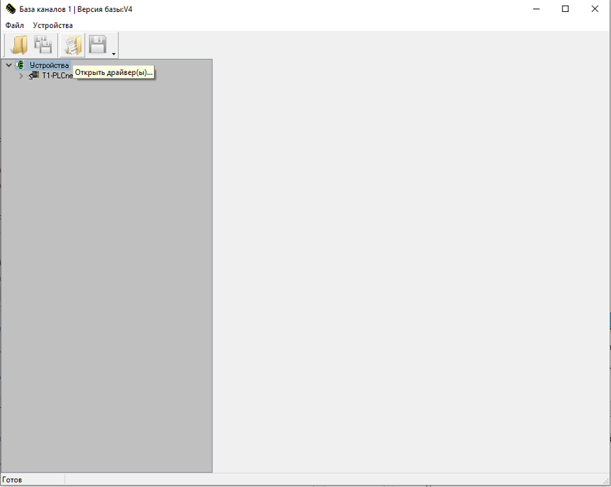 </p>
<p align="center"> Рысунак 2 - Дабаўленне драйвера </p>

- Выбіраем файл у каталоге D:\Monitor\chbase\T1_PLCNext_Demo.cdbx и выбіраем "Адкрыць".

- Далей у вкладцы "Прылады" выбіраем "T1_PLCNext_Demo" и правяраем IP адрас. Ён павінен быць наступным - `127.0.0.1`.

<p align="center">
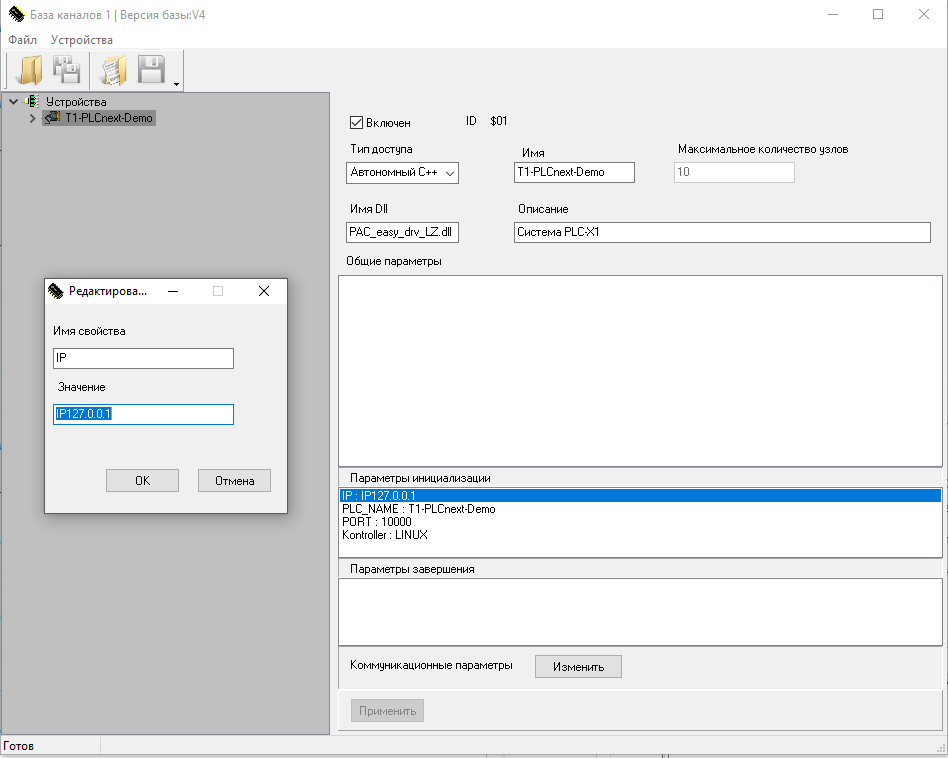 </p>
<p align="center"> Рысунак 3 - Змена IP адраса </p>

- Далей выбіраем "Ок".

- Пасля гэтага у каталоге D:\Monitor запускаем дадатак Bugger.exe, выбіраем "Паказаць" и правяраем, паспяхова лі загружан сервер.

### Устаноўка и наладка EasyServer

Easy Server знаходзіцца ў каталоге D:\Monitor\EasyServer.exe.

- Неабходна запусціць файл EasyServer.exe.

- У новым аконцы выбіраем "Наладкі сервера".

<p align="center">
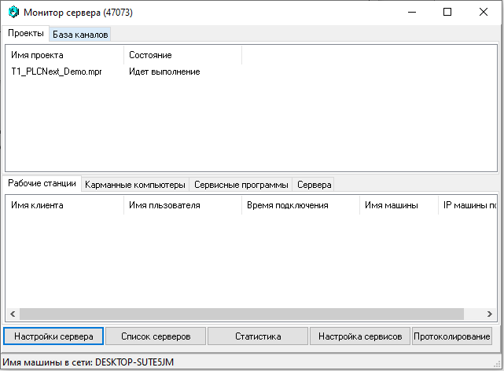 </p>
<p align="center"> Рысунак 4 - Наладка сервера </p>

- Пропісваем шлях D:\Monitor\chbase

<p align="center">
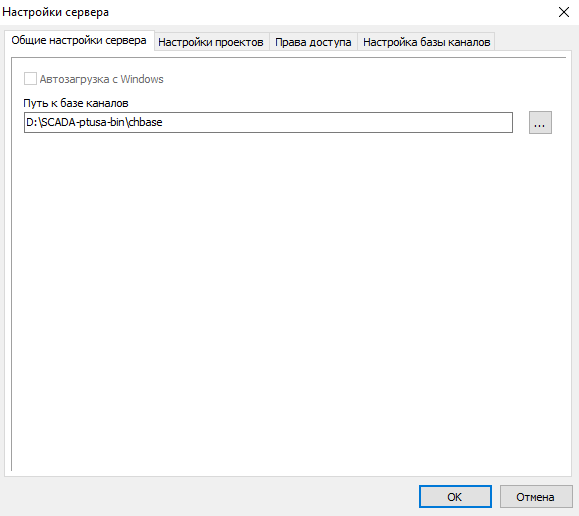 </p>
<p align="center"> Рысунак 5 - Наладка шляха да базы каналаў </p>

- Перехаходзім ў ўкладку "Наладкі проектаў" и добаўляем файл "T1_PLCNext_Demo.mpr", які знаходзіцца ў каталоге D:\Monitor\projects\T1_PLCNext_Demo.mpr.

<p align="center">
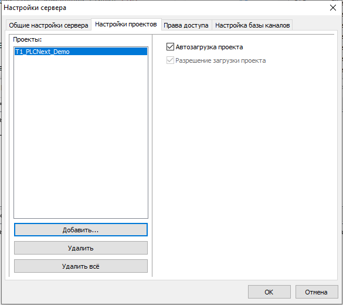 </p>
<p align="center"> Рысунак 6 - Наладка праекта </p>

- Далей пераходзім у ўкладку "Наладка базы каналаў" и добаўляем файл "T1_PLCNext_Demo.cdbx", які знаходзіцца у каталоге D:\Monitor\chbase\T1_PLCNext_Demo.cdbx.

<p align="center">
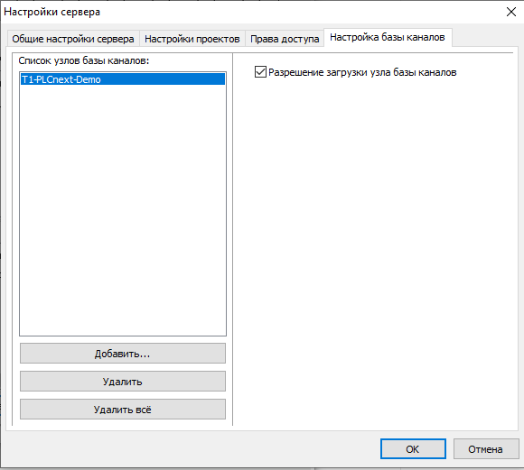 </p>
<p align="center"> Рысунак 7 - Наладка праекта </p>

- Пасля дабаўлення необходных файлаў выбіраем кнопку "Ok".

- Далей пераходзім у ўкладку "База каналаў".

<p align="center">
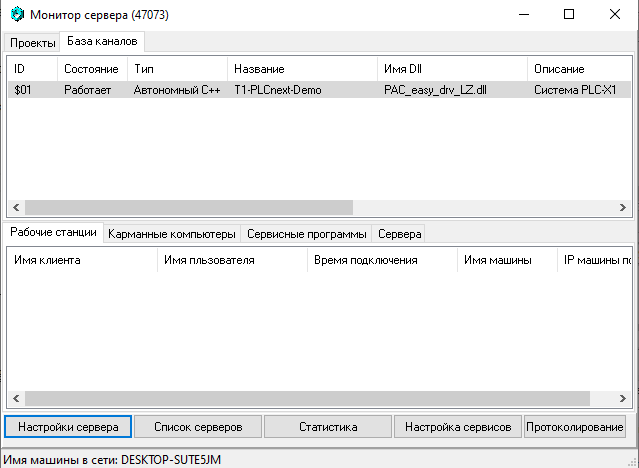 </p>
<p align="center"> Рысунак 8 - Наладка базы каналаў </p>

- Загружаем файл базы каналаў. Файл знаходзіцца у каталоге D:\Monitor\chbase\T1_PLCNext_Demo.cdbx.

<p align="center">
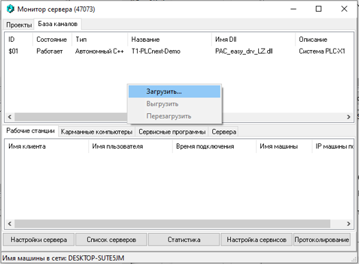 </p>
<p align="center"> Рысунак 9 - Наладка базы каналаў </p>

- Далей адкрываем праект. Файл знаходзіцца ў каталоге D:\Monitor\projects\T1_PLCNext_Demo.mpr.

<p align="center">
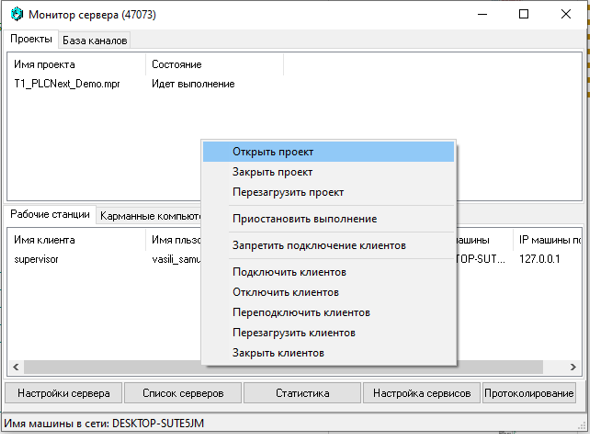 </p>
<p align="center"> Рысунак 10 - Адкрыцце праекта ў EasyServer </p>

### Устаноўка і наладка Monitor

Monitor знаходзіцца у каталоге D:\Monitor

- Неабходна запусціць файл Monitor.exe.

- У аконцы "Меню проектаў" націснем кнопку "Дабавіць" і выбіраем файл T1_PLCNext_Demo.mpr .

- Далей выбіраем праект "T1_PLCNext_Demo" і націсківаем на кнопку "Адкрыць".

- У новым акне запаўняем дадзеные, якія указаны на рысунке 10 і выбіраем "Ок".

<p align="center">
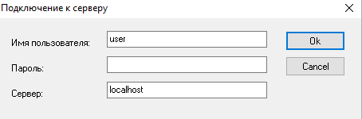 </p>
<p align="center"> Рысунак 11 - Падключэнне да сервера </p>

### Запуск і зборка праекта

Аписанне кіруючай праграмы рэалізавана ў выглядзе Lua-скрыптоў.

#### Visual Studio Code

Каб пратэсціраваць праект, у меню зверху выбіраем "Файл" -> "Адкрыць новую працоўную вобласць" -> "Выбіраем файл працоўный вобласці: (_D:\PTUSA-projects\T1_PLCNext_Demo\project.code-workspace_)".

- Тэсціраванне праекта ў VS Code робіцца некалькімі спосабамі:

1. "Тэрмінал" -> "Запуск задачы" -> "Debug run project";

2. Камбінацыя клавіш CTRL+SHIFT+B.

- Астаноўка тэсціравання робіцца некалькімі шляхамі:

1. "Тэрмінал" -> "Завяршыць задачу";

2. Камбінацыя клавіш CTRL+С пры актыўнам фокусе акна кансолі. Ў гэтым случае то што знаходзіцца ўнутры кансолі не чысціцца.

Запусціць EasyServer.

Запусціць Monitor.

Запусціць праект у Visual Studio Code.

<p align="center">
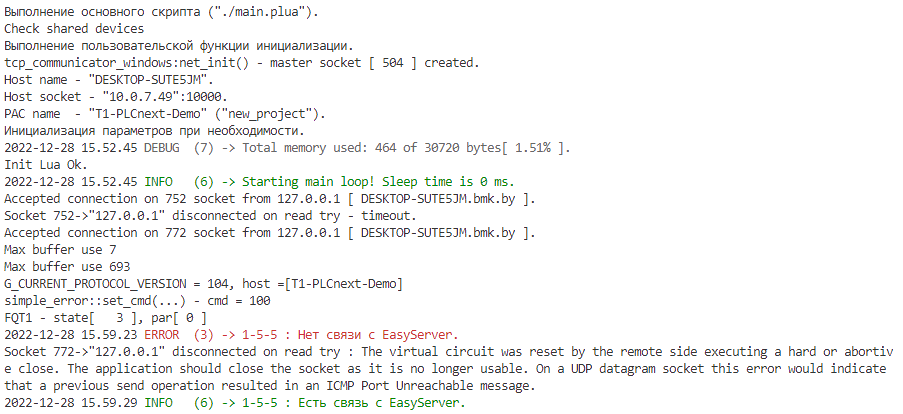 </p>
<p align="center"> Рысунак 12 - Visual Studio Code </p>

Злучэнне з Easy Server.

<p align="center">
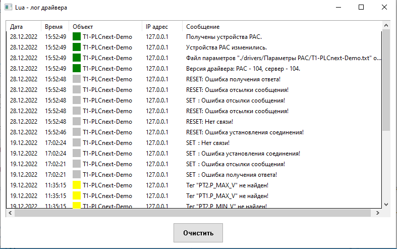 </p>
<p align="center"> Рысунак 13 - Easy Server </p>

У Monitor будуць відны ўсе прылады праекта теставага стэнда T1_PLCNext_Demo з магчымасцю кіравання.

<p align="center">
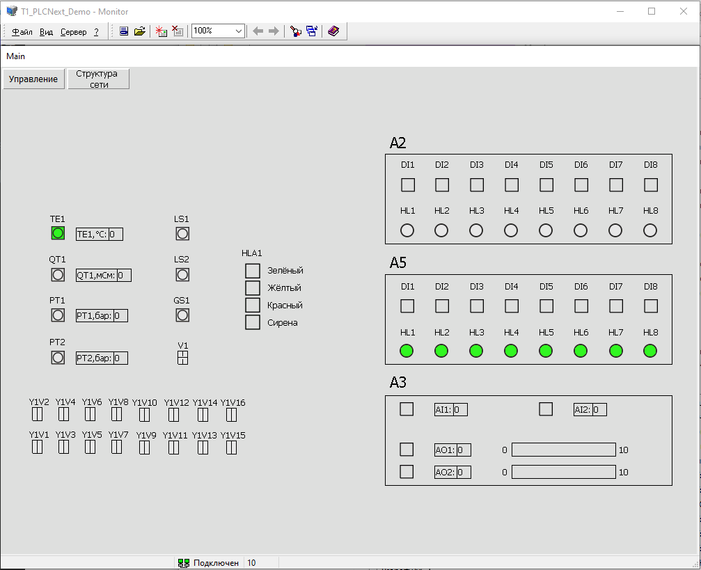 </p>
<p align="center"> Рысунак 14 - Monitor </p>

#### Visual Studio 2022

Каб сабраць проект необходна:

- кланіраваць рэпазіторыі [ptusa_main](https://github.com/NogameNo-life/ptusa_main) і [T1-PLCnext-Demo](https://github.com/NogameNo-life/T1-PLCnext-Demo/tree/readme_addition)

```cmd
git clone --recurse-submodules https://github.com/savushkin-r-d/ptusa_main.git
git clone --recurse-submodules https://github.com/savushkin-r-d/T1-PLCnext-Demo.git
```

Калі кланіравалі без падмодулей, то іх можна праініцыялізіраваць асобна:

  ```cmd
  git submodule --init --recursive
  ```

- запусціць Visual Studio, выбраць *адкрыць лакальны каталог->D:\\ ...\ptusa_main*

- зверху ў кіраўніцтве канфігурацыямі выбраць *Windows Debug(windows-VS2022-debug-build-windows-VS2022-debug)*

- выбраць элемент запуска *ptusa_main.exe(Debug\ptusa_main.exe)*

- далей неабходна перайсці ў *Адладка->Параметры адладкі і запуска для ptusa_main>* і даполніць файл *launch.vs.json*, прапісвая асаблівыя шляхі да файлаў

```Json
{
  "version": "0.2.1",
  "defaults": {},
  "configurations": [
    {
      "type": "default",
      "project": "CMakeLists.txt",
      "projectTarget": "ptusa_main.exe (Debug\\ptusa_main.exe)",
      "name": "ptusa_main.exe (Debug\\ptusa_main.exe)",
      "cwd": "d:/PTUSA-projects/T1-PLCnext-Demo/",
      "args": [
        "d:/T1-PLCnext-Demo/main.plua",
        "sys_path",
        "d:/T1-PLCnext-Demo/sys/",
        "path",
        "d:/T1-PLCnext-Demo/",
        "extra_paths",
        "d:/T1-PLCnext-Demo/dairy-sys/",
        "debug"
      ]
    }
  ]
}
```

Пасля чаго запусціць:

1. праграму ў рэжыме адладкі (F5)
2. EasyServer
3. Monitor

### Узаемадзеянне з фізічнай прыладай Bus Coupler

- З дапамогай Ethernet кабеля падключаем Bus Coupler да камп'ютара.

- Пераходзім па шляху Панель кіраўніцтва/Сетка і інтэрнэт/Сеткавыя падключэння, нажісківаем ПКМ на іконку неаппазнанай сеткі і выбіраем "Уласцівасці".

<p align="center">
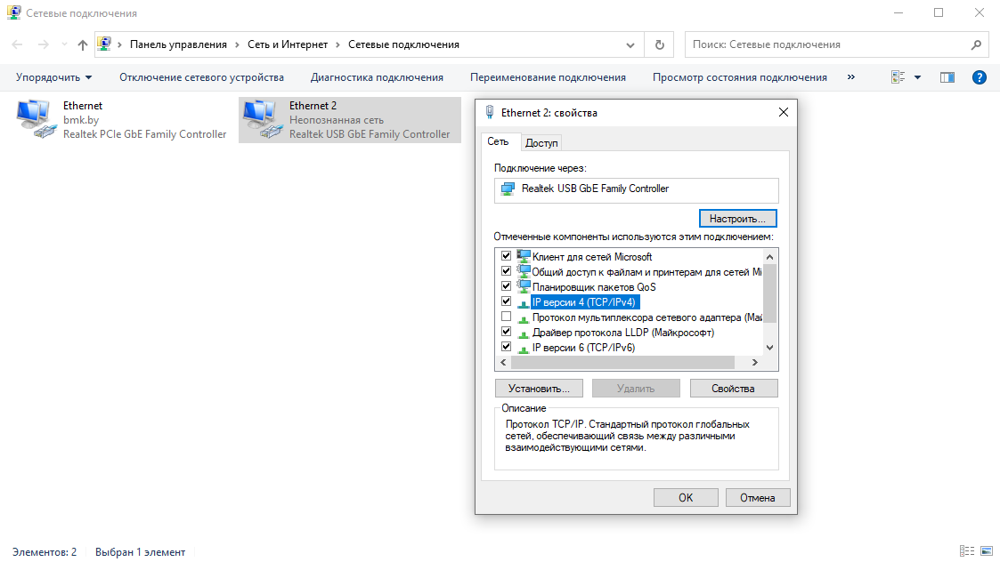 </p>
<p align="center"> Рысунак 15 - Наладка Ethernet </p>

- Выбіраем пункт "IP версіі 4 (TCP/IPv4)" і ціснем кнопку "Уласцівасці".

  - Запаўняем паля "IP-адрас" і "Маска падсетки" як паказана на рысунке 15.

<p align="center">
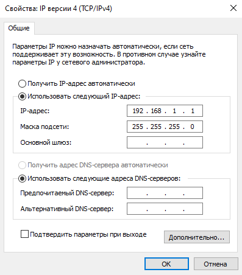 </p>
<p align="center"> Рысунак 16 - Указанне IP-адраса і маскі падсеткі </p>

- Правяраем карэктнасць наладкі лакальнай сетки Bus Coupler. У каманднай страке прапісваем каманду "ping 192.168.1.1".

<p align="center">
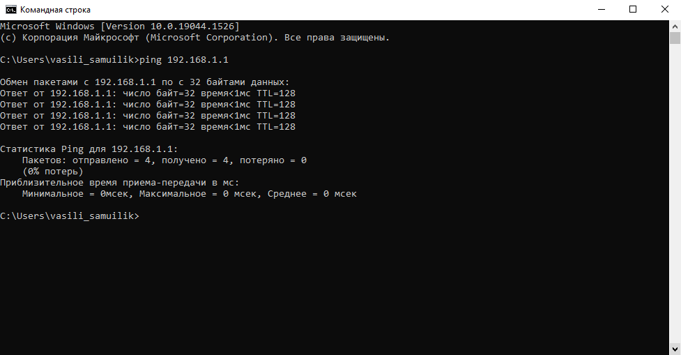 </p>
<p align="center"> Рысунак 16 - Паспяховая праца каманды "ping 192.168.1.1" </p>

- Правяраем існуе лі зувязь з Bus Coupler. У камандную страку праписваем каманду "ping 192.168.1.11".

<p align="center">
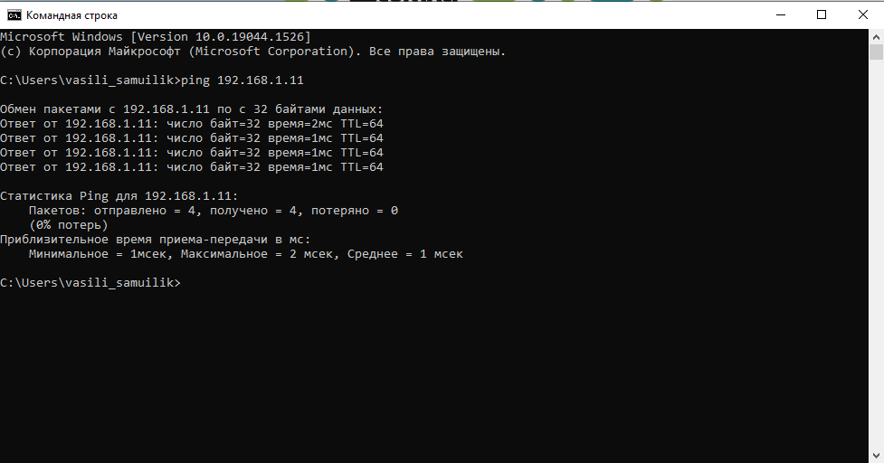 </p>
<p align="center"> Рысунак 18 - Паспяховая праца каманды "ping 192.168.1.11" </p>

- У браўзэры прапісваем IP-адрас: 192.168.1.11 і ціснем "Enter", пасля чаго адбудзецца пераход на стартавую старонку Bus Coupler.

<p align="center">
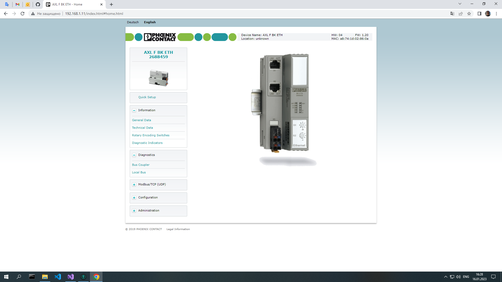 </p>
<p align="center"> Рысунак 19 - Стартавая старонка Bus Coupler </p>

## Запуск на кантролеры

### Праверка версіі прашыўкі праз вэб-браўзэр

- У адраснай страке ўводзім IP-адрас кантролера па змаўчанні *192.168.1.10*

Далей сайт апавясціць вас, што ваше злучэнне не з'яўляецца прыватным.

<p align="center">
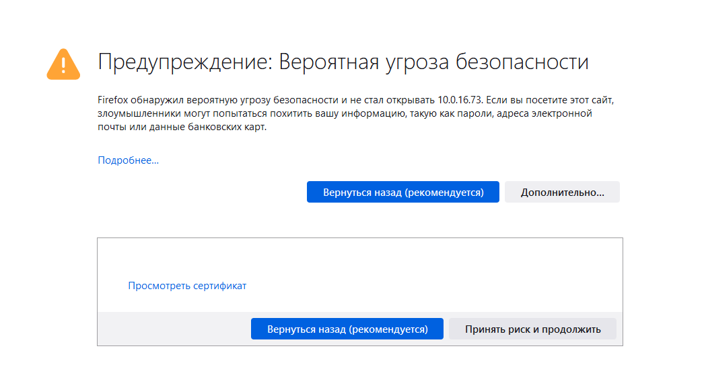
</p>
<p align="center"> Рысунак 20 - Старонка апавяшчэння </p>

- Неабходна выбраць **Приняць рызыск і працягнуць**

Далей вы перайдзёце на стартавую старонку кантролера.

<p align="center">

</p>
<p align="center"> Рысунак 21 - Старонка прывятання </p>

- Выбіраем **Easy configuration**

Па змаўнні ўвядзіце наступныя дадзеныя для аўтарызацыі:

```bash
Імя карыстальніка: admin
Пароль: на кантролеры.
```

Адбудзецца пераход на стартавую старонку кантролера.

<p align="center">
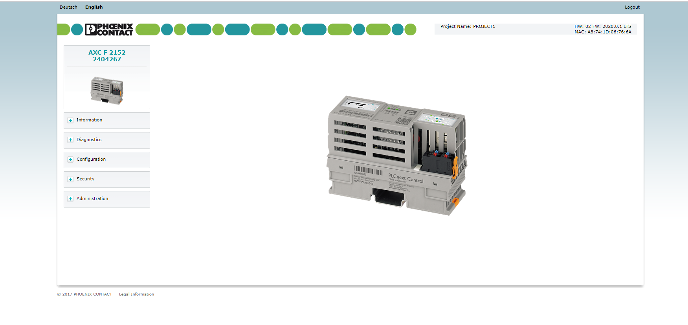
</p>
<p align="center"> Рысунак 22 - Стартавая старонка </p>

У правым верхнім вуглу можна пабачыць версію прашыўкі. Перад тым, як начаць працу з праектам, неабходна праверыць актуальнасць версіі прашыўкі. Калі на кантролеры устаноўлена апошняя прашыўка, то наступныя 3 пункта прапускаем.

### Устаноўка файлаў прашыўкі

Апошняя версія прашыўкі знаходзіцца [тут](https://www.phoenixcontact.com/en-pc/products/controller-axc-f-2152-2404267#downloads-link-target), у раздзеле Firmware спампуйце апошнія версіі Hardware Version і Compatible Tools.

Каб абнавіць прашыўку кантролера, выканайце наступныя дзеянні:

- Скачайце файл прашыўкі фармата *.zip апошняй версіі **LTS** на сайце Phoenix Contact.

- Распакуйце *.zip файл прашыўкі.

- Запусціце файл устаноўкі *.exe.

- Прытрымлівайцеся парадам майстра ўстаноўкі.

Пры ўстаноўцы, файл прашыўкі (*.raucb) і PDF-файлы з інфармацыей аб прыладзе будзуць скапіраваны ў выбраны каталог.

#### Абнаўленне прашыўкі праз вэб-браузэр

Для абнаўлення прашыўкі кантролера неабходно ў галіне **Administration** перайсці ў укладку **Firmware update**.

<p align="center">
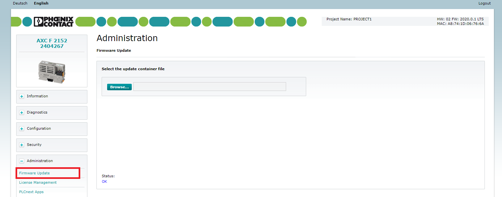
</p>
<p align="center"> Рысунак 23 - Старонка абнаўлення прашыўкі </p>

Затым націснем на кнопку **Browse...**, выбіраем файл прашыўкі (*.raucb) і ціснем на *Ok*.

Прашыўка будзе абноўлена. Калі пры абнауленні прашыўкі святлодыёд RUN пачынае мігаць, а затым гасне.
Пасля гэтага кантролер перазапускаеца. Пасля поўнай ініцыялізацыі кантролёра светлодыёд RUN гарыць заўсёды.

#### Абнаўленне прашыўкі кантролера праз камандную абалонку

- Адкройце кліентскае праграммнае забеспячэнне SFTP (напрыклад, [WinSCP](https://winscp.net/eng/index.php)).

- Аўтарызуйцеся як адміністратар.
<p align="center">
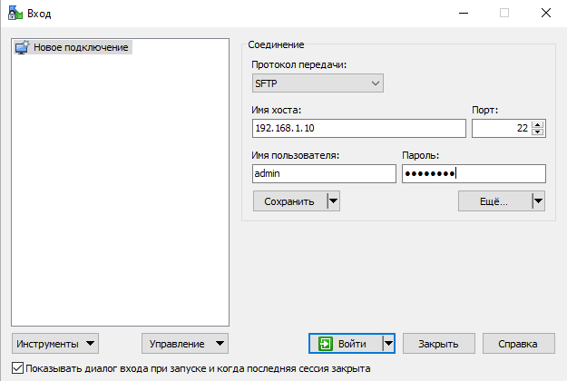
</p>
<p align="center"> Рысунак 24 - Аўтарызацыя ў WinSCP </p>

Па змаўчанні ўведзіце наступныя дадзеныя для аўтарызацыі:

```bash
Імя карыстальніка: admin
Пароль: на кантролеры.
```

<p align="center">
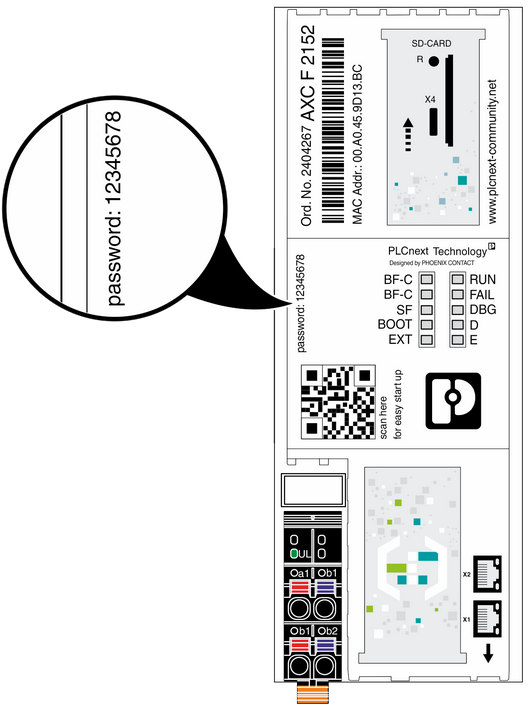
</p>
<p align="center"> Рысунак 25 - месцазнаходжанне пароля </p>

- Скапируйце файл прашыўкі *.raucb у **/opt/plcnext** каталог (каталог па змаўчанні карыстальніка Linux «admin»).

- Адкройце камандную абалонку з дапамогай інструмента каманднага радка (напрыклад, [PuTTY](https://www.putty.org/), у WinSCP спалучэнне клавіш Ctrl+P).

- Аўтарызуйцеся як адміністратар.

Па змаўчанні уведзіце наступныя дадзеныя для аўтарызацыі:
Імя карыстальніка: admin
Пароль: на кантролеры.

- Перайдзіце у **/opt/plcnext** каталог (каманда: *cd /opt/plcnext*).

- Для абнаўлення прашыўкі ўведзіце каманду:

```sh
sudo update-axcf2152
```

Патрэбна ўвесці пароль адміністратара.

Прашыўка будзе абнаўлена. Пры абнаўленні прашыўкі светлодыёд RUN пачне мігаць, а затым гасне.
Пасля таго кантролер перазапускаецца. Пасля поўнай ініцыялізацыі кантролера светлодыёд RUN гарыць заўсёды.
Файл абнаўлення аўтаматыческі удаляеца з **/opt/plcnext** directory.

### Стварэнне праекта PLCnext Engineer

Капиіруем каталог праекта *PLCnext*, які знаходзіцца тут - **https://github.com/savushkin-r-d/T1-PLCnext-Demo/releases/latest** - у каталог праекта ў падкаталог **PLCnext Engineer**.

### Праца з праектам ў асяроддзі PLCnext Engineer

Запускаем PLCnext Engineer, адчыняем файл праекта, які находзіца ў гэтым каталоге - **PLCnext Engineer\T1-PLCNext-Demo.pcwex**.

Адчыняем уласцівасці праекта (двайное націскванне мышью па элементу дрэва **Project**) - здесь мы бачым сеткавыя наладкі для прылады праекта (кантролераў і вузлоў уводу\вываду).

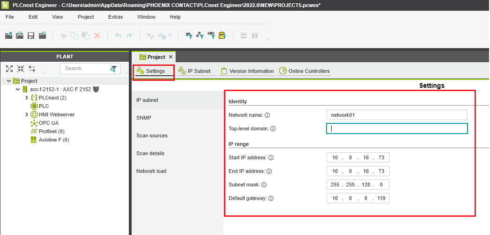
<p align="center"> Рысунак 26 - Увод налалдак сеткі </p>

Пры неабходнасці, мяняем сеткавыя наладкі прылад праекта на гэтай старонцы.

На ўкладке **IP Subnet** паказваюцца наладкі кантролера праекта (яшчэ іх можна редакціраваць):

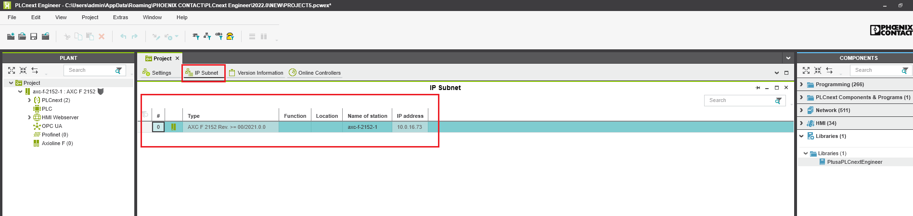
<p align="center"> Рысунак 27 - Увод наладак падсеткі </p>

### Увод сеткавых наладак кантролера

Падключаем кантролер да сетки. Пераходзім да укладкі **Online Controllers**, выбіраем *Ethernet 2 Realtek USB GbE Family Controller* и націсківаем кнопку *Scan the network*:

<p align="center">
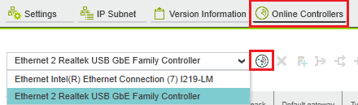 </p>
<p align="center"> Рысунак 28 - Пошук кантролера </p>

Пасля паспяховага пошука ў гэтым акне з'явяцца адшукаваныя прылады - павінен з'явіцца падключаны кантролер з настройкамі па змаўчанні:

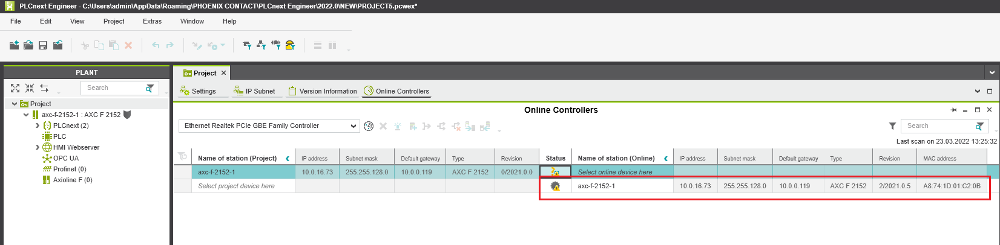
<p align="center"> Рысунак 29 - Адшукаваныя кантролеры </p>

Указваем для найдзенага кантролера яго адпаведнасць у праекце. Для гэтага патрэбна выбраць кантролер з необходным MAC address, указаным на корпусе:

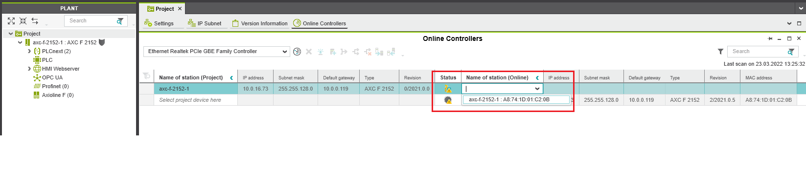
<p align="center"> Рысунак 30 - Даданне кантролера </p>

Гэты кантролер далучыцца ў праект, праз некаторы час ён адлюструецца з новымі наладкамі:

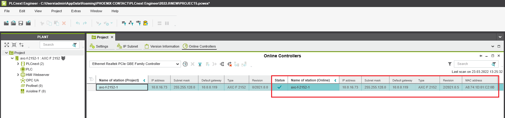
<p align="center"> Рысунак 31 - Кантролеры ў праекце </p>

### Падключэнне да кантролера ў праграме PLCnext Engineer

Пераходзім на ўкладку з наладкамі кантролера:

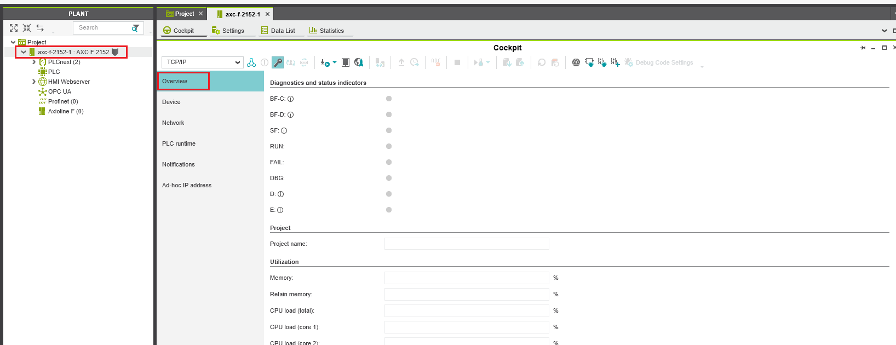
<p align="center"> Рысунак 32 - Агляд кантролера </p>

Далей ціснем на кнопку падключэння:

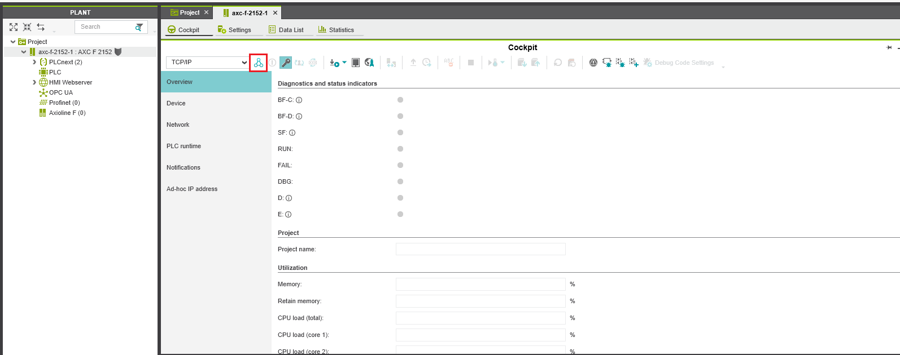
<p align="center"> Рысунак 33 - Падключэнне да кантролера </p>

Далей уводзім імя карыстальніка (**admin**) і пароль (**напячатан на корпусе кантролера**). Пасля паспяховага падключэння адлюстроўваюцца параметры кантролера:

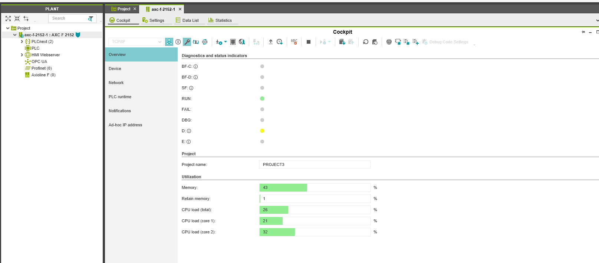
<p align="center"> Рысунак 34 - Падключанны кантролер </p>

### Абнаўленне бібліятэкі

Апошняя версія бібліятэкі знаходзіцца [тут](https://github.com/savushkin-r-d/ptusa_main/releases).

#### Абнаўленне бібліятэкі праз камандную оболонку

Каб абнавіць бібліятэкі праз камандную абалочку неабходна:

- Скачаць файл апошняй версіі бібліятэкі (*.PCWLX).

- Скапіраваць гэты файл з заменай у папку **PLCnext** неабходнага праекта.

- Адкройце кліентскае праграмнае забеспячэнне SFTP (напрыклад **WinSCP**).

- Аўтарызуйцесь як адміністратар (**admin - звярніцеся да адміністратара**).

- Капіраваць файл з заменай файла бібліятэкі з **/AXCF2152_22.0.4.144/Release/lib/libPtusaPLCnextEngineer.so** у каталог **/opt/plcnext/projects/PCWE/Libs/Ptusa**, дзе `AXCF2152_22.0.4.144` - адпаведная версія бібліятэкі.

-  Камандную абалонку з дапамогай інструмента каманднага радка (напрыклад, **KiTTY**).

- Аўтарызуйцеся як адміністратар (**admin - звярніцеся да адміністратара**).

- Перазапусціце службу **plcnext** (каманда: **sudo /etc/init.d/plcnext restart**).

#### Абнаўленне бібліятэкі праз праграммнае забеспячэнне PLCnext Engineer

Для абнаўлення бібліятэкі з дапамогай праграмнаго забеспячэння патрэбна:

- Скачаць файл апошняй версіі бібліятэкі (*.PCWLX).

- Скапіраваць гэты файл з заменай у папку **PLCnext** неабходнага праекта.

- Запускаем PLCnext Engineer, адчыняем файл праекта, які знаходзіца ў гэтым каталоге **PLCnext Engineer\T1-PLCNext-Demo.pcwex**.

- Перайдзем на ўкладку з наладкамі кантролера (рысунак 30).

- Потым выбіраем кнопку падключэння (рысунак 32).

- Уводзім імя карыстальніка **admin** і пароль **звярніцеся да адміністратара**. Пасля паспяховага падключэння вы пабачаце параметры кантролера.

- Націснем на кнопку Запісаць і пачаць выкананне (F5) (рысунак 33).

### Капіраванне Lua-файлаў праекта

Патрэбна праз **SFTP** інтэрфэйс запісаць файлы канфигурацыі праекта на кантролер у каталог **/opt/main**.

Для гэтага прапануецца выкарыстоўваць праграму [WinSCP](https://winscp.net/eng/index.php).

Выбіраем файлы праекта, якія необходна записаць на кантролер. Гэтыя файлы знаходзяцца ў каталоге праекта. Спис файлаў, якія апісваюць праект:

- __*main.plua*__ - апісанне кіруючай праграмы;
- __*main.io.lua*__ - апісанне прывязкі прылад да модулей увода/вываду;
- __*main.modbus_srv.lua*__ - апісанне ўзаемадзеяння з modbus-кліентамі;
- __*main.objects.lua*__ - апісанне аб'ектаў праекта;
- __*main.profibus.lua*__ - апісанне profibus;
- __*main.restrictions.lua*__ - апісанне абмежаванняў;
- __*prg.lua*__ - апісанне прылад, агрэгатаў.

Таксама неабходна скапираваць сістэмныя файлы з каталога **sys**. Спис сістэмных файлаў:

- __*sys.devices.lua*__ - апісанне прылад;
- __*sys.objects.lua*__ - апісанне аб'ектаў;
- __*sys.io.lua*__ - апісанне модулёў увода-вываду;

Капіруем дадзеные файлы на кантролер у асобна створаны каталог **/opt/main/sys**.

### Уключэнне суперкарыстальніка

Каб уключыць карыстальніка **root** далучаемся па ssh (выкарыстоўваючы **Kitty**) і выкарыстоўваем наступную каманду:

```sh
sudo passwd root
```

Пасля ўвода пароля карыстальніка задаем пароль для **root** .

```sh
Password:
Changing password for root
Enter the new password (minimum of 5 characters)
Please use a combination of upper and lower case letters and numbers.
New password:
Re-enter new password:
passwd: password changed.
```

### Актывацыя ўваходу па SSH у якасці карыстальніка root

- Далучыцеся да кантролера і ўвайдзіце ў сістэму **admin**.

- Адчыніце файл */etc/ssh/sshd_config* у прыдатным рэдактары ў **WinSCP**.

- У раздзеле #Authentication: раскаментуйце запісь: `#PermitRootLogin yes`.

- Перазапусціце службу SSH з дапамогай *sudo /etc/init.d/sshd restart*

### Деактывацыя ўвхода па SSH у якасці карыстальніка root

- Далучыцеся да кантролеру і ўвайдзіце ў сістэму **admin**.

- Адчыніце файл */etc/ssh/sshd_config* у прыдатным рэдактары (**WinSCP**).

- У раздзеле #Authentication: закаменціруейце запісь: `PermitRootLogin yes`.

- Перазапусціце службу SSH з дапамогай *sudo /etc/init.d/sshd restart*

### Чытанне логаў

Для чытання паведамленняў ад кіруючай програмы далучаемся па ssh (карыстуючыся **Kitty**). Чытанне логаў даступна для карыстальніка **root**. Для пераключэння карыстальніка выконваем наступную каманду:

```sh
su
```

Далей ўводзім пароль. Пасля паспяховага пераключэння адлюстроўваецца адпаведны запрос каманднага радка:

```sh
root@axcf2152:/opt/plcnext/#
```

Для чытання аварыйных лагаў выкарыстоўваем наступную каманду:

```sh
tail -F /var/log/error | grep ptusa
```

Для чытання ўсех іншых логаў карыстуемся наступнай камандай:

```sh
tail -F /var/log/messages | awk '
  /info/ {print "\033[32m" $0 "\033[39m"; next}
  /warn/ {print "\033[33m" $0 "\033[39m"; next}
  1 {print}
  ' | grep ptusa
```

### Запуск праекта праз **PLCnext Engineer**

Націснем кнопку **Запісаць і пачаць выконванне**:

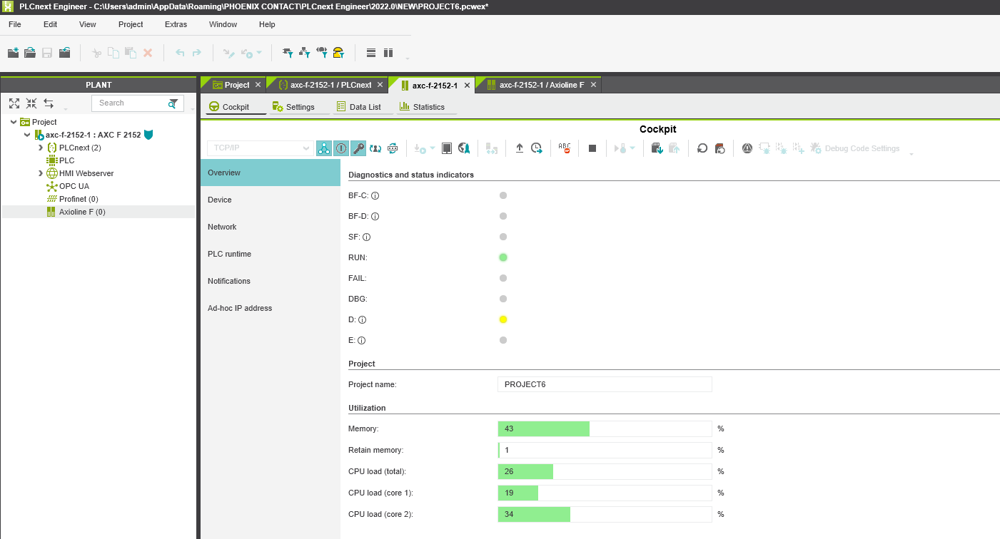
<p align="center"> Рысунак 35 - Запуск праекта</p>

Пры паспяховым запуске ў акне прагляда логаў не павінна быць аварыйных паведамленняў:

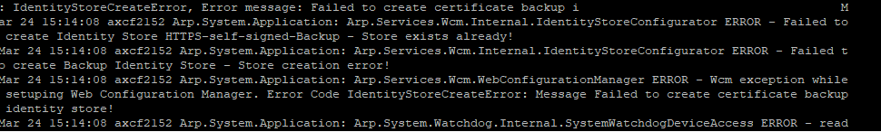
<p align="center"> Рысунак 36 - Прогляд паведамленняў </p>

### Кіраванне ходам выканання праекта

Для перазапуска патрэбна выканаць наступную каманду ў кансолі:

```sh
sudo /etc/init.d/plcnext restart
```

Каб спыніць і запусціць праект, неабходна выканаць наступныя каманды ў кансолі:

```sh
sudo /etc/init.d/plcnext stop
sudo /etc/init.d/plcnext start
```

### Наладка прылад сапражэння з шынай *AXL F BK ETH*

#### Патрэбна азнаёміцца з дадаткам [Startup+](https://www.phoenixcontact.com/online/portal/us/?uri=pxc-oc-itemdetail:pid=2700636&library=usen&pcck=P&tab=1&selectedCategory=ALL).

Скачаць з сайта Phoenix Contact утыліту [Startup+ от Phoenix Contact](https://www.phoenixcontact.com/online/portal/us/?uri=pxc-oc-itemdetail:pid=2700636&library=usen&pcck=P&tab=1&selectedCategory=ALL) для настройки. После запуска данной утилиты открывается главное окно и выбираем создать новый проект:

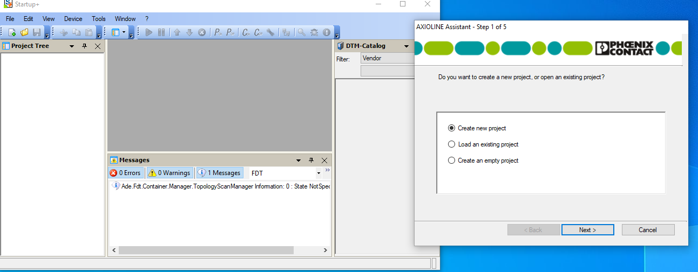
<p align="center"> Рысунак 37 - Запуск утыліты</p>

У наступным акне выбіраем мадель прылады сапражэння з шынай (Указана на корпусе прылады):

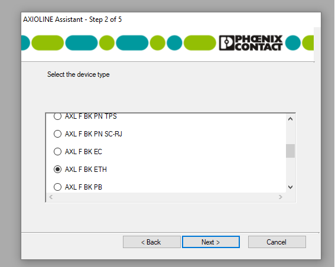
<p align="center"> Рысунак 37 - Выбар маделі прылады сапражэння з шынай</p>

Ціснем на **Next** і выбіраем тып далучэння. У нашым выпадке Ethernet:

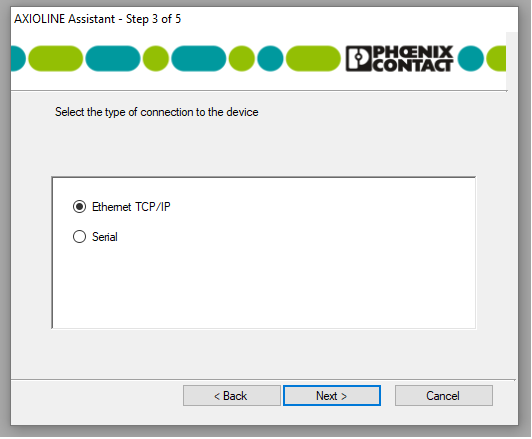
<p align="center"> Рысунак 39 - Наладка сеткавых параметраў</p>

Далей выбіраем пункт *Адшукаць прыладу ў сетцы і задаць IP address*:

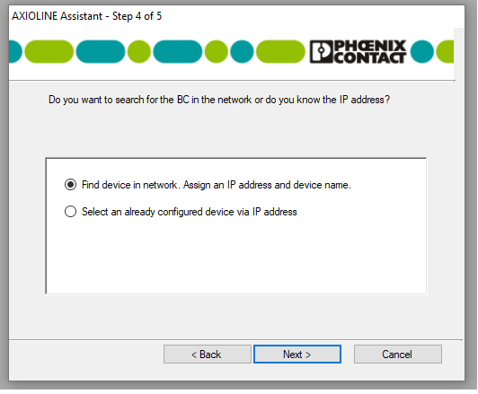
<p align="center"> Рысунак 40 - Наладка сеткавых параметраў</p>

Далей у списе знайдзеных прылад (якія адсылаюць запрос) патрэбна выбраць патрэбнае (MAC адрас прылады павінен адпавядаць MAC адрасу, які нанясён на корпус наладачнага вузла BK ETH). Праз двайны націск па патрэбнай прыладзе пераходзім да акна наладкі:

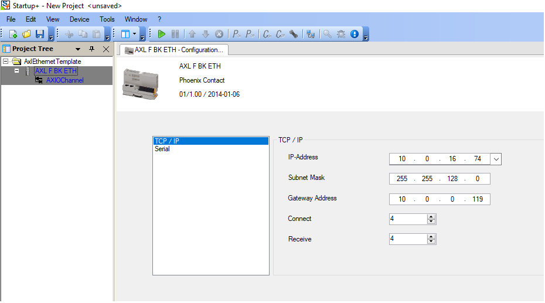
<p align="center"> Рысунак 41 - Наладка сеткавых параметраў</p>

Задаем патрэбныя наладкі і запісваем іх у прыладу.
- В DbEditorXML мяняем ip на *192.168.1.10*.
- Запускаем EasyServer і Monitor.

### Запуск праекта праз кансоль

Для запуска праекта праз кансоль патрэбна:

1. Устанавіць Toolchain патрэбнай версіі (подрабязная інструкцыя па ўстаноўцы [тут](https://github.com/savushkin-r-d/ptusa_main#using-plcnext-technology-c-toolchain-in-windows)).

2. Далучаемся да кантролера праз карыстаўніцкае праграмнае забеспячэнне [WinSCP](https://winscp.net/eng/index.php).

3. Перайсці ў каталог для свайго кантролера `ptusa_main\bin\install\AXCF3152\Release\bin\` і адсюль скапіраваць выканальны файл `ptusa_main` у свой каталог на кантролеры, напрыклад, `/opt/main/`.

4. Далей ў гэты самы каталог скапіраваць файлы з пашырэннем `lua` і `plua`, а таксама дырэкторыі `spec` і `sys` з праекта `T1-PLCnext-Demo`.

5. Пасля чаго адчыніць Kitty, перайсці ў каталог з ўсімі скапіраванымі файламі

```bash
cd /opt/main/
```

І запусціць выкананы файл `ptusa_main`

```bash
./ptusa_main main.plua sys_path ./sys/
```

Калі ўзнікаюць памылкі `Permission denied`, дабаўце файлу флаг -x, каб зрабіць яго выконвываючым. Гэта можна зрабіць альбо праз інтэрфэйс ***WinSCP***, альбо праз кансоль з дапамогай каманды `chmod`.

```bash
chmod +x ptusa_main
```

## Наіменаванне модуляў і прылад

Распрацаваны дэмастэнд:


<p align="center"> Рысунак 42 - Агульны выгляд</p>


<p align="center"> Рысунак 43 - Кантролер і вузел увода\выводу</p>

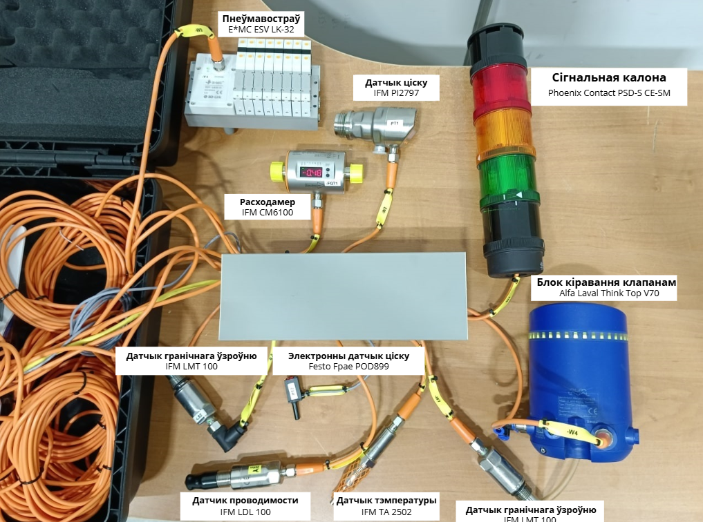
<p align="center"> Рысунак 44 - Датчыкі і выканаўчыя прылады</p>
